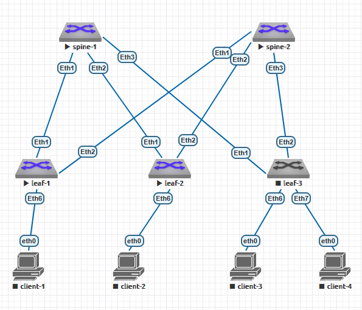

#  Домашнее задание №3
# Underlay. ISIS
## по теме №6 "Построение Underlay сети(ISIS)"
### Цель: Настроить ISIS для Underlay сети
### Задачи:
+ настроить ISIS в Underlay сети, для IP связанности между всеми сетевыми устройствами;
+ зафиксировать в документации - план работы, адресное пространство, схему сети, конфигурацию устройств;
+ проверить IP-связанность между устройствами в ISIS домене.
## Практическая часть
#### Схема ЦОД
1. Схема сети



2. Адресное пространство для Underlay
+ Lo1 - 172.16.XNN.0/16, где X нечётный - spine, X чётный - leaf; N - номер коммутатора 
+ Lo2 - 172.17.XNN.0/16, где X нечётный - spine, X чётный - leaf; N - номер коммутатора
+ P2P links - 172.18.NNN.0/15, где N - номер коммутатора spine

Таблица адресов
  
| Hostname | Interface |  	IP/MASK    |	Description |
|----------|-----------|---------------|--------------|
|spine-1   |Eth1     |172.18.1.0/31  |-L- leaf-1    |
|spine-1   |Eth2     |172.18.1.2/31  |-L- leaf-2    |
|spine-1   |Eth3     |172.18.1.4/31  |-L- leaf-3    |
|spine-1   |L01        |172.16.101.1/32  |              |
|spine-1   |L02        |172.17.101.1/32|              |
|spine-2   |Eth1     |172.18.2.0/31  |-L- leaf-1    |
|spine-2   |Eth2     |172.18.2.2/31  |-L- leaf-2    |
|spine-2   |Eth3     |172.18.2.4/31  |-L- leaf-3    |
|spine-2   |L01        |172.16.102.1/32  |              |
|spine-2   |L02        |172.17.102.1/32|              |
|leaf-1    |Eth1     |172.18.1.1/31  |-L- spine-1    |
|leaf-1    |Eth2     |172.18.2.1/31  |-L- spine-2    |
|leaf-1    |L01        |172.16.201.1/32 |              |
|leaf-1    |L02        |172.17.201.1/32|              |
|leaf-2    |Eth1     |172.18.1.3/31  |-L- spine-1    |
|leaf-2    |Eth2     |172.18.2.3/31  |-L- spine-2    |
|leaf-2    |L01        |172.16.202.1/32 |              |
|leaf-2    |L02        |172.17.202.1/32|              |
|leaf-3    |Eth1     |172.18.1.5/31  |-L- spine-1    |
|leaf-3    |Eth2     |172.18.2.5/31  |-L- spine-2    |
|leaf-3    |L01        |172.16.203.1/32 |              |
|leaf-3    |L02        |172.17.203.1/32|              |

3. Настройки ISIS приложены в файлах leaf-x.txt и spine-x.txt (базовые настройки приведены в ДЗ №1). Далее выборочно приведены настройки оборудования:

**Коммутатор spine-1**

```
spine-1#show run
...
hostname spine-1
!
spanning-tree mode mstp
!
interface Ethernet1
   description -L- leaf-1
   no switchport
   ip address 172.18.1.0/31
   isis enable 10
   isis bfd
   isis network point-to-point
   isis authentication mode md5
   isis authentication key 7 bMtaY5EaFQ/hSDpSm56UHg==
!
interface Ethernet2
   description -L- leaf-2
   no switchport
   ip address 172.18.1.2/31
   isis enable 10
   isis bfd
   isis network point-to-point
   isis authentication mode md5
   isis authentication key 7 bMtaY5EaFQ/hSDpSm56UHg==
!
interface Ethernet3
   description -L- leaf-3
   no switchport
   ip address 172.18.1.4/31
   isis enable 10
   isis bfd
   isis network point-to-point
   isis authentication mode md5
   isis authentication key 7 bMtaY5EaFQ/hSDpSm56UHg==
!
...
!
interface Loopback1
   ip address 172.16.101.1/32
   isis enable 10
!
interface Loopback2
   ip address 172.17.101.1/32
   isis enable 10
!
interface Management1
!
ip routing
!
router isis 10
   net 49.0001.0010.0100.1001.00
   is-type level-1
   log-adjacency-changes
   authentication mode md5
   authentication key 7 bMtaY5EaFQ/hSDpSm56UHg==
   !
   address-family ipv4 unicast
      bfd all-interfaces
!
end
spine-1#
```

**Коммутатор spine-2**

```
spine-2#show run
...
hostname spine-2
!
spanning-tree mode mstp
!
interface Ethernet1
   description -L- leaf-1
   no switchport
   ip address 172.18.2.0/31
   isis enable 10
   isis bfd
   isis network point-to-point
   isis authentication mode md5
   isis authentication key 7 bMtaY5EaFQ/hSDpSm56UHg==
!
interface Ethernet2
   description -L- leaf-2
   no switchport
   ip address 172.18.2.2/31
   isis enable 10
   isis bfd
   isis network point-to-point
   isis authentication mode md5
   isis authentication key 7 bMtaY5EaFQ/hSDpSm56UHg==
!
interface Ethernet3
   description -L- leaf-3
   no switchport
   ip address 172.18.2.4/31
   isis enable 10
   isis bfd
   isis network point-to-point
   isis authentication mode md5
   isis authentication key 7 bMtaY5EaFQ/hSDpSm56UHg==
!
...
!
interface Loopback1
   ip address 172.16.102.1/32
   isis enable 10
!
interface Loopback2
   ip address 172.17.102.1/32
   isis enable 10
!
interface Management1
!
ip routing
!
router isis 10
   net 49.0001.0010.0100.1002.00
   is-type level-1
   log-adjacency-changes
   authentication mode md5
   authentication key 7 bMtaY5EaFQ/hSDpSm56UHg==
   !
   address-family ipv4 unicast
      bfd all-interfaces
!
end
spine-2#
```

**Коммутатор leaf-1**

```
leaf-1#
leaf-1#show run
...
hostname leaf-1
!
spanning-tree mode mstp
!
interface Ethernet1
   description -S- spine-1
   no switchport
   ip address 172.18.1.1/31
   isis enable 10
   isis bfd
   isis network point-to-point
   isis authentication mode md5
   isis authentication key 7 bMtaY5EaFQ/hSDpSm56UHg==
!
interface Ethernet2
   description -S- spine-2
   no switchport
   ip address 172.18.2.1/31
   isis enable 10
   isis bfd
   isis network point-to-point
   isis authentication mode md5
   isis authentication key 7 bMtaY5EaFQ/hSDpSm56UHg==
!
...
!
interface Loopback1
   ip address 172.16.201.1/32
   isis enable 10
!
interface Loopback2
   ip address 172.17.201.1/32
   isis enable 10
!
interface Management1
!
ip routing
!
router isis 10
   net 49.0001.0010.0100.2001.00
   is-type level-1
   log-adjacency-changes
   authentication mode md5
   authentication key 7 bMtaY5EaFQ/hSDpSm56UHg==
   !
   address-family ipv4 unicast
      bfd all-interfaces
!
end
leaf-1#
```

**Коммутатор leaf-2**

```
leaf-2#show run
...
hostname leaf-2
!
spanning-tree mode mstp
!
interface Ethernet1
   description -S- spine-1
   no switchport
   ip address 172.18.1.3/31
   isis enable 10
   isis bfd
   isis network point-to-point
   isis authentication mode md5
   isis authentication key 7 bMtaY5EaFQ/hSDpSm56UHg==
!
interface Ethernet2
   description -S- spine-2
   no switchport
   ip address 172.18.2.3/31
   isis enable 10
   isis bfd
   isis network point-to-point
   isis authentication mode md5
   isis authentication key 7 bMtaY5EaFQ/hSDpSm56UHg==
!
...
!
interface Loopback1
   ip address 172.16.202.1/32
   isis enable 10
!
interface Loopback2
   ip address 172.17.202.1/32
   isis enable 10
!
interface Management1
!
ip routing
!
router isis 10
   net 49.0001.0010.0100.2002.00
   is-type level-1
   log-adjacency-changes
   authentication mode md5
   authentication key 7 bMtaY5EaFQ/hSDpSm56UHg==
   !
   address-family ipv4 unicast
      bfd all-interfaces
!
end
leaf-2#
```

**Коммутатор leaf-3**

```
leaf-3#show run
...
hostname leaf-3
!
spanning-tree mode mstp
!
interface Ethernet1
   description -S- spine-1
   no switchport
   ip address 172.18.1.5/31
   isis enable 10
   isis bfd
   isis network point-to-point
   isis authentication mode md5
   isis authentication key 7 bMtaY5EaFQ/hSDpSm56UHg==
!
interface Ethernet2
   description -S- spine-2
   no switchport
   ip address 172.18.2.5/31
   isis enable 10
   isis bfd
   isis network point-to-point
   isis authentication mode md5
   isis authentication key 7 bMtaY5EaFQ/hSDpSm56UHg==
!
...
!
interface Loopback1
   ip address 172.16.203.1/32
   isis enable 10
!
interface Loopback2
   ip address 172.17.203.1/32
   isis enable 10
!
interface Management1
!
ip routing
!
router isis 10
   net 49.0001.0010.0100.2003.00
   is-type level-1
   log-adjacency-changes
   authentication mode md5
   authentication key 7 bMtaY5EaFQ/hSDpSm56UHg==
   !
   address-family ipv4 unicast
      bfd all-interfaces
!
end
leaf-3#
```

4. Проверка связности между устройствами в OSPF домене проводилась утилитой **ping**. Проверлась связность от текущего коммутатора до интерфейсов Loopback1 и Loopback2 других коммутаторов.

**Коммутатор spine-1**

```
spine-1#ping 172.16.102.1
PING 172.16.102.1 (172.16.102.1) 72(100) bytes of data.
80 bytes from 172.16.102.1: icmp_seq=1 ttl=63 time=74.4 ms
80 bytes from 172.16.102.1: icmp_seq=2 ttl=63 time=100 ms
80 bytes from 172.16.102.1: icmp_seq=3 ttl=63 time=56.8 ms
80 bytes from 172.16.102.1: icmp_seq=4 ttl=63 time=18.6 ms
80 bytes from 172.16.102.1: icmp_seq=5 ttl=63 time=23.7 ms

--- 172.16.102.1 ping statistics ---
5 packets transmitted, 5 received, 0% packet loss, time 214ms
rtt min/avg/max/mdev = 18.678/54.874/100.653/30.850 ms, pipe 3, ipg/ewma 53.743/62.512 ms
spine-1#
spine-1#ping 172.17.102.1
PING 172.17.102.1 (172.17.102.1) 72(100) bytes of data.
80 bytes from 172.17.102.1: icmp_seq=1 ttl=63 time=23.6 ms
80 bytes from 172.17.102.1: icmp_seq=2 ttl=63 time=20.9 ms
80 bytes from 172.17.102.1: icmp_seq=3 ttl=63 time=18.2 ms
80 bytes from 172.17.102.1: icmp_seq=4 ttl=63 time=20.3 ms
80 bytes from 172.17.102.1: icmp_seq=5 ttl=63 time=19.2 ms

--- 172.17.102.1 ping statistics ---
5 packets transmitted, 5 received, 0% packet loss, time 88ms
rtt min/avg/max/mdev = 18.261/20.505/23.654/1.834 ms, pipe 2, ipg/ewma 22.220/22.005 ms
spine-1#
spine-1#ping 172.16.201.1
PING 172.16.201.1 (172.16.201.1) 72(100) bytes of data.
80 bytes from 172.16.201.1: icmp_seq=1 ttl=64 time=9.65 ms
80 bytes from 172.16.201.1: icmp_seq=2 ttl=64 time=9.99 ms
80 bytes from 172.16.201.1: icmp_seq=3 ttl=64 time=9.12 ms
80 bytes from 172.16.201.1: icmp_seq=4 ttl=64 time=8.30 ms
80 bytes from 172.16.201.1: icmp_seq=5 ttl=64 time=13.5 ms

--- 172.16.201.1 ping statistics ---
5 packets transmitted, 5 received, 0% packet loss, time 49ms
rtt min/avg/max/mdev = 8.307/10.116/13.509/1.789 ms, ipg/ewma 12.388/9.964 ms
spine-1#
spine-1#ping 172.17.201.1
PING 172.17.201.1 (172.17.201.1) 72(100) bytes of data.
80 bytes from 172.17.201.1: icmp_seq=1 ttl=64 time=9.40 ms
80 bytes from 172.17.201.1: icmp_seq=2 ttl=64 time=7.46 ms
80 bytes from 172.17.201.1: icmp_seq=3 ttl=64 time=8.72 ms
80 bytes from 172.17.201.1: icmp_seq=4 ttl=64 time=10.2 ms
80 bytes from 172.17.201.1: icmp_seq=5 ttl=64 time=14.2 ms

--- 172.17.201.1 ping statistics ---
5 packets transmitted, 5 received, 0% packet loss, time 49ms
rtt min/avg/max/mdev = 7.467/10.023/14.282/2.316 ms, ipg/ewma 12.300/9.879 ms
spine-1#
spine-1#ping 172.16.202.1
PING 172.16.202.1 (172.16.202.1) 72(100) bytes of data.
80 bytes from 172.16.202.1: icmp_seq=1 ttl=64 time=13.6 ms
80 bytes from 172.16.202.1: icmp_seq=2 ttl=64 time=8.19 ms
80 bytes from 172.16.202.1: icmp_seq=3 ttl=64 time=8.19 ms
80 bytes from 172.16.202.1: icmp_seq=4 ttl=64 time=8.95 ms
80 bytes from 172.16.202.1: icmp_seq=5 ttl=64 time=8.49 ms

--- 172.16.202.1 ping statistics ---
5 packets transmitted, 5 received, 0% packet loss, time 53ms
rtt min/avg/max/mdev = 8.191/9.498/13.655/2.100 ms, ipg/ewma 13.320/11.516 ms
spine-1#
spine-1#ping 172.17.202.1
PING 172.17.202.1 (172.17.202.1) 72(100) bytes of data.
80 bytes from 172.17.202.1: icmp_seq=1 ttl=64 time=24.6 ms
80 bytes from 172.17.202.1: icmp_seq=2 ttl=64 time=16.6 ms
80 bytes from 172.17.202.1: icmp_seq=3 ttl=64 time=10.7 ms
80 bytes from 172.17.202.1: icmp_seq=4 ttl=64 time=10.1 ms
80 bytes from 172.17.202.1: icmp_seq=5 ttl=64 time=7.51 ms

--- 172.17.202.1 ping statistics ---
5 packets transmitted, 5 received, 0% packet loss, time 84ms
rtt min/avg/max/mdev = 7.512/13.925/24.626/6.124 ms, pipe 2, ipg/ewma 21.100/18.902 ms
spine-1#
spine-1#ping 172.16.203.1
PING 172.16.203.1 (172.16.203.1) 72(100) bytes of data.
80 bytes from 172.16.203.1: icmp_seq=1 ttl=64 time=13.7 ms
80 bytes from 172.16.203.1: icmp_seq=2 ttl=64 time=12.6 ms
80 bytes from 172.16.203.1: icmp_seq=3 ttl=64 time=9.47 ms
80 bytes from 172.16.203.1: icmp_seq=4 ttl=64 time=11.2 ms
80 bytes from 172.16.203.1: icmp_seq=5 ttl=64 time=8.68 ms

--- 172.16.203.1 ping statistics ---
5 packets transmitted, 5 received, 0% packet loss, time 64ms
rtt min/avg/max/mdev = 8.683/11.164/13.797/1.905 ms, pipe 2, ipg/ewma 16.054/12.366 ms
spine-1#
spine-1#ping 172.17.203.1
PING 172.17.203.1 (172.17.203.1) 72(100) bytes of data.
80 bytes from 172.17.203.1: icmp_seq=1 ttl=64 time=9.24 ms
80 bytes from 172.17.203.1: icmp_seq=2 ttl=64 time=12.4 ms
80 bytes from 172.17.203.1: icmp_seq=3 ttl=64 time=11.9 ms
80 bytes from 172.17.203.1: icmp_seq=4 ttl=64 time=11.7 ms
80 bytes from 172.17.203.1: icmp_seq=5 ttl=64 time=8.81 ms

--- 172.17.203.1 ping statistics ---
5 packets transmitted, 5 received, 0% packet loss, time 49ms
rtt min/avg/max/mdev = 8.819/10.853/12.442/1.516 ms, pipe 2, ipg/ewma 12.366/9.997 ms
spine-1#
```

**Коммутатор spine-2**

```
spine-2#ping 172.16.101.1
PING 172.16.101.1 (172.16.101.1) 72(100) bytes of data.
80 bytes from 172.16.101.1: icmp_seq=1 ttl=63 time=22.3 ms
80 bytes from 172.16.101.1: icmp_seq=2 ttl=63 time=77.4 ms
80 bytes from 172.16.101.1: icmp_seq=3 ttl=63 time=44.6 ms
80 bytes from 172.16.101.1: icmp_seq=4 ttl=63 time=26.4 ms
80 bytes from 172.16.101.1: icmp_seq=5 ttl=63 time=22.2 ms

--- 172.16.101.1 ping statistics ---
5 packets transmitted, 5 received, 0% packet loss, time 138ms
rtt min/avg/max/mdev = 22.244/38.637/77.469/21.094 ms, pipe 2, ipg/ewma 34.530/29.548 ms
spine-2#
spine-2#ping 172.17.101.1
PING 172.17.101.1 (172.17.101.1) 72(100) bytes of data.
80 bytes from 172.17.101.1: icmp_seq=1 ttl=63 time=29.9 ms
80 bytes from 172.17.101.1: icmp_seq=2 ttl=63 time=24.3 ms
80 bytes from 172.17.101.1: icmp_seq=3 ttl=63 time=22.4 ms
80 bytes from 172.17.101.1: icmp_seq=4 ttl=63 time=17.8 ms
80 bytes from 172.17.101.1: icmp_seq=5 ttl=63 time=18.0 ms

--- 172.17.101.1 ping statistics ---
5 packets transmitted, 5 received, 0% packet loss, time 84ms
rtt min/avg/max/mdev = 17.893/22.522/29.916/4.465 ms, pipe 3, ipg/ewma 21.032/25.932 ms
spine-2#
spine-2#ping 172.16.201.1
PING 172.16.201.1 (172.16.201.1) 72(100) bytes of data.
80 bytes from 172.16.201.1: icmp_seq=1 ttl=64 time=10.2 ms
80 bytes from 172.16.201.1: icmp_seq=2 ttl=64 time=7.65 ms
80 bytes from 172.16.201.1: icmp_seq=3 ttl=64 time=8.10 ms
80 bytes from 172.16.201.1: icmp_seq=4 ttl=64 time=9.14 ms
80 bytes from 172.16.201.1: icmp_seq=5 ttl=64 time=9.53 ms

--- 172.16.201.1 ping statistics ---
5 packets transmitted, 5 received, 0% packet loss, time 56ms
rtt min/avg/max/mdev = 7.652/8.947/10.297/0.961 ms, ipg/ewma 14.099/9.644 ms
spine-2#
spine-2#ping 172.17.201.1
PING 172.17.201.1 (172.17.201.1) 72(100) bytes of data.
80 bytes from 172.17.201.1: icmp_seq=1 ttl=64 time=9.63 ms
80 bytes from 172.17.201.1: icmp_seq=2 ttl=64 time=8.45 ms
80 bytes from 172.17.201.1: icmp_seq=3 ttl=64 time=12.5 ms
80 bytes from 172.17.201.1: icmp_seq=4 ttl=64 time=13.9 ms
80 bytes from 172.17.201.1: icmp_seq=5 ttl=64 time=15.2 ms

--- 172.17.201.1 ping statistics ---
5 packets transmitted, 5 received, 0% packet loss, time 48ms
rtt min/avg/max/mdev = 8.454/11.975/15.278/2.567 ms, pipe 2, ipg/ewma 12.020/10.992 ms
spine-2#
spine-2#ping 172.16.202.1
PING 172.16.202.1 (172.16.202.1) 72(100) bytes of data.
80 bytes from 172.16.202.1: icmp_seq=1 ttl=64 time=10.0 ms
80 bytes from 172.16.202.1: icmp_seq=2 ttl=64 time=8.34 ms
80 bytes from 172.16.202.1: icmp_seq=3 ttl=64 time=8.59 ms
80 bytes from 172.16.202.1: icmp_seq=4 ttl=64 time=7.83 ms
80 bytes from 172.16.202.1: icmp_seq=5 ttl=64 time=8.06 ms

--- 172.16.202.1 ping statistics ---
5 packets transmitted, 5 received, 0% packet loss, time 61ms
rtt min/avg/max/mdev = 7.831/8.574/10.038/0.780 ms, ipg/ewma 15.409/9.270 ms
spine-2#
spine-2#ping 172.17.202.1
PING 172.17.202.1 (172.17.202.1) 72(100) bytes of data.
80 bytes from 172.17.202.1: icmp_seq=1 ttl=64 time=9.53 ms
80 bytes from 172.17.202.1: icmp_seq=2 ttl=64 time=8.99 ms
80 bytes from 172.17.202.1: icmp_seq=3 ttl=64 time=8.01 ms
80 bytes from 172.17.202.1: icmp_seq=4 ttl=64 time=7.98 ms
80 bytes from 172.17.202.1: icmp_seq=5 ttl=64 time=8.86 ms

--- 172.17.202.1 ping statistics ---
5 packets transmitted, 5 received, 0% packet loss, time 48ms
rtt min/avg/max/mdev = 7.986/8.679/9.539/0.607 ms, ipg/ewma 12.101/9.093 ms
spine-2#
spine-2#ping 172.16.203.1
PING 172.16.203.1 (172.16.203.1) 72(100) bytes of data.
80 bytes from 172.16.203.1: icmp_seq=1 ttl=64 time=14.2 ms
80 bytes from 172.16.203.1: icmp_seq=2 ttl=64 time=10.6 ms
80 bytes from 172.16.203.1: icmp_seq=3 ttl=64 time=9.27 ms
80 bytes from 172.16.203.1: icmp_seq=4 ttl=64 time=7.24 ms
80 bytes from 172.16.203.1: icmp_seq=5 ttl=64 time=16.5 ms

--- 172.16.203.1 ping statistics ---
5 packets transmitted, 5 received, 0% packet loss, time 64ms
rtt min/avg/max/mdev = 7.245/11.599/16.525/3.370 ms, ipg/ewma 16.171/13.016 ms
spine-2#
spine-2#ping 172.17.203.1
PING 172.17.203.1 (172.17.203.1) 72(100) bytes of data.
80 bytes from 172.17.203.1: icmp_seq=1 ttl=64 time=9.98 ms
80 bytes from 172.17.203.1: icmp_seq=2 ttl=64 time=19.1 ms
80 bytes from 172.17.203.1: icmp_seq=3 ttl=64 time=17.4 ms
80 bytes from 172.17.203.1: icmp_seq=4 ttl=64 time=8.93 ms
80 bytes from 172.17.203.1: icmp_seq=5 ttl=64 time=8.76 ms

--- 172.17.203.1 ping statistics ---
5 packets transmitted, 5 received, 0% packet loss, time 58ms
rtt min/avg/max/mdev = 8.767/12.870/19.188/4.514 ms, pipe 2, ipg/ewma 14.707/11.203 ms
spine-2#
spine-2#
```

**Коммутатор leaf-1**

```
leaf-1#ping 172.16.101.1
PING 172.16.101.1 (172.16.101.1) 72(100) bytes of data.
80 bytes from 172.16.101.1: icmp_seq=1 ttl=64 time=11.1 ms
80 bytes from 172.16.101.1: icmp_seq=2 ttl=64 time=8.51 ms
80 bytes from 172.16.101.1: icmp_seq=3 ttl=64 time=7.16 ms
80 bytes from 172.16.101.1: icmp_seq=4 ttl=64 time=8.31 ms
80 bytes from 172.16.101.1: icmp_seq=5 ttl=64 time=7.89 ms

--- 172.16.101.1 ping statistics ---
5 packets transmitted, 5 received, 0% packet loss, time 57ms
rtt min/avg/max/mdev = 7.164/8.612/11.177/1.366 ms, ipg/ewma 14.266/9.846 ms
leaf-1#
leaf-1#ping 172.17.101.1
PING 172.17.101.1 (172.17.101.1) 72(100) bytes of data.
80 bytes from 172.17.101.1: icmp_seq=1 ttl=64 time=11.7 ms
80 bytes from 172.17.101.1: icmp_seq=2 ttl=64 time=12.0 ms
80 bytes from 172.17.101.1: icmp_seq=3 ttl=64 time=10.0 ms
80 bytes from 172.17.101.1: icmp_seq=4 ttl=64 time=9.87 ms
80 bytes from 172.17.101.1: icmp_seq=5 ttl=64 time=12.0 ms

--- 172.17.101.1 ping statistics ---
5 packets transmitted, 5 received, 0% packet loss, time 59ms
rtt min/avg/max/mdev = 9.872/11.147/12.066/0.972 ms, ipg/ewma 14.948/11.422 ms
leaf-1#
leaf-1#ping 172.16.102.1
PING 172.16.102.1 (172.16.102.1) 72(100) bytes of data.
80 bytes from 172.16.102.1: icmp_seq=1 ttl=64 time=13.9 ms
80 bytes from 172.16.102.1: icmp_seq=2 ttl=64 time=10.5 ms
80 bytes from 172.16.102.1: icmp_seq=3 ttl=64 time=10.4 ms
80 bytes from 172.16.102.1: icmp_seq=4 ttl=64 time=7.51 ms
80 bytes from 172.16.102.1: icmp_seq=5 ttl=64 time=9.20 ms

--- 172.16.102.1 ping statistics ---
5 packets transmitted, 5 received, 0% packet loss, time 67ms
rtt min/avg/max/mdev = 7.512/10.339/13.994/2.133 ms, ipg/ewma 16.776/12.057 ms
leaf-1#
leaf-1#ping 172.17.102.1
PING 172.17.102.1 (172.17.102.1) 72(100) bytes of data.
80 bytes from 172.17.102.1: icmp_seq=1 ttl=64 time=11.3 ms
80 bytes from 172.17.102.1: icmp_seq=2 ttl=64 time=8.92 ms
80 bytes from 172.17.102.1: icmp_seq=3 ttl=64 time=20.0 ms
80 bytes from 172.17.102.1: icmp_seq=4 ttl=64 time=11.6 ms
80 bytes from 172.17.102.1: icmp_seq=5 ttl=64 time=9.67 ms

--- 172.17.102.1 ping statistics ---
5 packets transmitted, 5 received, 0% packet loss, time 58ms
rtt min/avg/max/mdev = 8.928/12.338/20.071/4.001 ms, pipe 2, ipg/ewma 14.633/11.803 ms
leaf-1#
leaf-1#ping 172.16.202.1
PING 172.16.202.1 (172.16.202.1) 72(100) bytes of data.
80 bytes from 172.16.202.1: icmp_seq=1 ttl=63 time=107 ms
80 bytes from 172.16.202.1: icmp_seq=2 ttl=63 time=104 ms
80 bytes from 172.16.202.1: icmp_seq=3 ttl=63 time=97.9 ms
80 bytes from 172.16.202.1: icmp_seq=4 ttl=63 time=93.0 ms
80 bytes from 172.16.202.1: icmp_seq=5 ttl=63 time=122 ms

--- 172.16.202.1 ping statistics ---
5 packets transmitted, 5 received, 0% packet loss, time 50ms
rtt min/avg/max/mdev = 93.001/105.028/122.170/9.981 ms, pipe 5, ipg/ewma 12.723/106.810 ms
leaf-1#
leaf-1#ping 172.17.202.1
PING 172.17.202.1 (172.17.202.1) 72(100) bytes of data.
80 bytes from 172.17.202.1: icmp_seq=1 ttl=63 time=29.8 ms
80 bytes from 172.17.202.1: icmp_seq=2 ttl=63 time=27.4 ms
80 bytes from 172.17.202.1: icmp_seq=3 ttl=63 time=24.3 ms
80 bytes from 172.17.202.1: icmp_seq=4 ttl=63 time=16.6 ms
80 bytes from 172.17.202.1: icmp_seq=5 ttl=63 time=16.7 ms

--- 172.17.202.1 ping statistics ---
5 packets transmitted, 5 received, 0% packet loss, time 83ms
rtt min/avg/max/mdev = 16.647/22.984/29.843/5.442 ms, pipe 3, ipg/ewma 20.793/26.024 ms
leaf-1#
leaf-1#ping 172.16.203.1
PING 172.16.203.1 (172.16.203.1) 72(100) bytes of data.
80 bytes from 172.16.203.1: icmp_seq=1 ttl=63 time=32.9 ms
80 bytes from 172.16.203.1: icmp_seq=2 ttl=63 time=42.0 ms
80 bytes from 172.16.203.1: icmp_seq=3 ttl=63 time=39.8 ms
80 bytes from 172.16.203.1: icmp_seq=4 ttl=63 time=31.9 ms
80 bytes from 172.16.203.1: icmp_seq=5 ttl=63 time=18.0 ms

--- 172.16.203.1 ping statistics ---
5 packets transmitted, 5 received, 0% packet loss, time 97ms
rtt min/avg/max/mdev = 18.058/32.983/42.060/8.409 ms, pipe 3, ipg/ewma 24.265/32.408 ms
leaf-1#
leaf-1#ping 172.17.203.1
PING 172.17.203.1 (172.17.203.1) 72(100) bytes of data.
80 bytes from 172.17.203.1: icmp_seq=1 ttl=63 time=21.9 ms
80 bytes from 172.17.203.1: icmp_seq=2 ttl=63 time=22.4 ms
80 bytes from 172.17.203.1: icmp_seq=3 ttl=63 time=17.9 ms
80 bytes from 172.17.203.1: icmp_seq=4 ttl=63 time=19.8 ms
80 bytes from 172.17.203.1: icmp_seq=5 ttl=63 time=16.3 ms

--- 172.17.203.1 ping statistics ---
5 packets transmitted, 5 received, 0% packet loss, time 89ms
rtt min/avg/max/mdev = 16.379/19.694/22.401/2.306 ms, pipe 2, ipg/ewma 22.287/20.662 ms
leaf-1#
```

**Коммутатор leaf-2**

```
leaf-2#ping 172.16.101.1
PING 172.16.101.1 (172.16.101.1) 72(100) bytes of data.
80 bytes from 172.16.101.1: icmp_seq=1 ttl=64 time=12.6 ms
80 bytes from 172.16.101.1: icmp_seq=2 ttl=64 time=12.4 ms
80 bytes from 172.16.101.1: icmp_seq=3 ttl=64 time=9.92 ms
80 bytes from 172.16.101.1: icmp_seq=4 ttl=64 time=10.2 ms
80 bytes from 172.16.101.1: icmp_seq=5 ttl=64 time=10.4 ms

--- 172.16.101.1 ping statistics ---
5 packets transmitted, 5 received, 0% packet loss, time 59ms
rtt min/avg/max/mdev = 9.923/11.152/12.693/1.184 ms, ipg/ewma 14.958/11.859 msleaf-2#
leaf-2#ping 172.17.101.1
PING 172.17.101.1 (172.17.101.1) 72(100) bytes of data.
80 bytes from 172.17.101.1: icmp_seq=1 ttl=64 time=9.35 ms
80 bytes from 172.17.101.1: icmp_seq=2 ttl=64 time=13.8 ms
80 bytes from 172.17.101.1: icmp_seq=3 ttl=64 time=19.1 ms
80 bytes from 172.17.101.1: icmp_seq=4 ttl=64 time=12.5 ms
80 bytes from 172.17.101.1: icmp_seq=5 ttl=64 time=10.9 ms

--- 172.17.101.1 ping statistics ---
5 packets transmitted, 5 received, 0% packet loss, time 61ms
rtt min/avg/max/mdev = 9.350/13.160/19.117/3.341 ms, pipe 2, ipg/ewma 15.320/11.209 ms
leaf-2#
leaf-2#ping 172.16.102.1
PING 172.16.102.1 (172.16.102.1) 72(100) bytes of data.
80 bytes from 172.16.102.1: icmp_seq=1 ttl=64 time=10.9 ms
80 bytes from 172.16.102.1: icmp_seq=2 ttl=64 time=8.12 ms
80 bytes from 172.16.102.1: icmp_seq=3 ttl=64 time=9.30 ms
80 bytes from 172.16.102.1: icmp_seq=4 ttl=64 time=9.23 ms
80 bytes from 172.16.102.1: icmp_seq=5 ttl=64 time=9.56 ms

--- 172.16.102.1 ping statistics ---
5 packets transmitted, 5 received, 0% packet loss, time 57ms
rtt min/avg/max/mdev = 8.125/9.440/10.973/0.915 ms, ipg/ewma 14.488/10.208 ms
leaf-2#
leaf-2#ping 172.17.102.1
PING 172.17.102.1 (172.17.102.1) 72(100) bytes of data.
80 bytes from 172.17.102.1: icmp_seq=1 ttl=64 time=9.30 ms
80 bytes from 172.17.102.1: icmp_seq=2 ttl=64 time=9.45 ms
80 bytes from 172.17.102.1: icmp_seq=3 ttl=64 time=9.18 ms
80 bytes from 172.17.102.1: icmp_seq=4 ttl=64 time=8.03 ms
80 bytes from 172.17.102.1: icmp_seq=5 ttl=64 time=15.5 ms

--- 172.17.102.1 ping statistics ---
5 packets transmitted, 5 received, 0% packet loss, time 46ms
rtt min/avg/max/mdev = 8.032/10.314/15.595/2.690 ms, ipg/ewma 11.560/9.951 ms
leaf-2#
leaf-2#ping 172.16.201.1
PING 172.16.201.1 (172.16.201.1) 72(100) bytes of data.
80 bytes from 172.16.201.1: icmp_seq=1 ttl=63 time=22.9 ms
80 bytes from 172.16.201.1: icmp_seq=2 ttl=63 time=40.1 ms
80 bytes from 172.16.201.1: icmp_seq=3 ttl=63 time=41.1 ms
80 bytes from 172.16.201.1: icmp_seq=4 ttl=63 time=25.9 ms
80 bytes from 172.16.201.1: icmp_seq=5 ttl=63 time=26.5 ms

--- 172.16.201.1 ping statistics ---
5 packets transmitted, 5 received, 0% packet loss, time 92ms
rtt min/avg/max/mdev = 22.942/31.351/41.116/7.676 ms, pipe 2, ipg/ewma 23.101/26.909 ms
leaf-2#
leaf-2#ping 172.17.201.1
PING 172.17.201.1 (172.17.201.1) 72(100) bytes of data.
80 bytes from 172.17.201.1: icmp_seq=1 ttl=63 time=26.3 ms
80 bytes from 172.17.201.1: icmp_seq=2 ttl=63 time=31.5 ms
80 bytes from 172.17.201.1: icmp_seq=3 ttl=63 time=25.6 ms
80 bytes from 172.17.201.1: icmp_seq=4 ttl=63 time=38.4 ms
80 bytes from 172.17.201.1: icmp_seq=5 ttl=63 time=22.5 ms

--- 172.17.201.1 ping statistics ---
5 packets transmitted, 5 received, 0% packet loss, time 97ms
rtt min/avg/max/mdev = 22.507/28.902/38.496/5.602 ms, pipe 2, ipg/ewma 24.443/27.582 ms
leaf-2#
leaf-2#ping 172.16.203.1
PING 172.16.203.1 (172.16.203.1) 72(100) bytes of data.
80 bytes from 172.16.203.1: icmp_seq=1 ttl=63 time=19.9 ms
80 bytes from 172.16.203.1: icmp_seq=2 ttl=63 time=17.0 ms
80 bytes from 172.16.203.1: icmp_seq=3 ttl=63 time=21.1 ms
80 bytes from 172.16.203.1: icmp_seq=4 ttl=63 time=16.9 ms
80 bytes from 172.16.203.1: icmp_seq=5 ttl=63 time=17.1 ms

--- 172.16.203.1 ping statistics ---
5 packets transmitted, 5 received, 0% packet loss, time 79ms
rtt min/avg/max/mdev = 16.918/18.455/21.157/1.760 ms, pipe 2, ipg/ewma 19.788/19.151 ms
leaf-2#
leaf-2#ping 172.17.203.1
PING 172.17.203.1 (172.17.203.1) 72(100) bytes of data.
80 bytes from 172.17.203.1: icmp_seq=1 ttl=63 time=22.3 ms
80 bytes from 172.17.203.1: icmp_seq=2 ttl=63 time=19.1 ms
80 bytes from 172.17.203.1: icmp_seq=3 ttl=63 time=27.7 ms
80 bytes from 172.17.203.1: icmp_seq=4 ttl=63 time=37.1 ms
80 bytes from 172.17.203.1: icmp_seq=5 ttl=63 time=22.3 ms

--- 172.17.203.1 ping statistics ---
5 packets transmitted, 5 received, 0% packet loss, time 86ms
rtt min/avg/max/mdev = 19.133/25.761/37.150/6.334 ms, pipe 2, ipg/ewma 21.593/24.236 ms
leaf-2#
```

**Коммутатор leaf-3**

```
leaf-3#ping 172.16.101.1
PING 172.16.101.1 (172.16.101.1) 72(100) bytes of data.
80 bytes from 172.16.101.1: icmp_seq=1 ttl=64 time=12.8 ms
80 bytes from 172.16.101.1: icmp_seq=2 ttl=64 time=15.0 ms
80 bytes from 172.16.101.1: icmp_seq=3 ttl=64 time=23.0 ms
80 bytes from 172.16.101.1: icmp_seq=4 ttl=64 time=35.3 ms
80 bytes from 172.16.101.1: icmp_seq=5 ttl=64 time=25.4 ms

--- 172.16.101.1 ping statistics ---
5 packets transmitted, 5 received, 0% packet loss, time 76ms
rtt min/avg/max/mdev = 12.810/22.332/35.382/8.053 ms, pipe 2, ipg/ewma 19.017/18.017 ms
leaf-3#
leaf-3#ping 172.17.101.1
PING 172.17.101.1 (172.17.101.1) 72(100) bytes of data.
80 bytes from 172.17.101.1: icmp_seq=1 ttl=64 time=13.0 ms
80 bytes from 172.17.101.1: icmp_seq=2 ttl=64 time=8.33 ms
80 bytes from 172.17.101.1: icmp_seq=3 ttl=64 time=7.80 ms
80 bytes from 172.17.101.1: icmp_seq=4 ttl=64 time=10.0 ms
80 bytes from 172.17.101.1: icmp_seq=5 ttl=64 time=7.78 ms

--- 172.17.101.1 ping statistics ---
5 packets transmitted, 5 received, 0% packet loss, time 55ms
rtt min/avg/max/mdev = 7.785/9.406/13.045/2.001 ms, ipg/ewma 13.944/11.165 ms
leaf-3#
leaf-3#ping 172.16.102.1
PING 172.16.102.1 (172.16.102.1) 72(100) bytes of data.
80 bytes from 172.16.102.1: icmp_seq=1 ttl=64 time=15.4 ms
80 bytes from 172.16.102.1: icmp_seq=2 ttl=64 time=16.3 ms
80 bytes from 172.16.102.1: icmp_seq=3 ttl=64 time=9.13 ms
80 bytes from 172.16.102.1: icmp_seq=4 ttl=64 time=10.1 ms
80 bytes from 172.16.102.1: icmp_seq=5 ttl=64 time=8.65 ms

--- 172.16.102.1 ping statistics ---
5 packets transmitted, 5 received, 0% packet loss, time 57ms
rtt min/avg/max/mdev = 8.659/11.955/16.341/3.271 ms, pipe 2, ipg/ewma 14.279/13.502 ms
leaf-3#
leaf-3#ping 172.17.102.1
PING 172.17.102.1 (172.17.102.1) 72(100) bytes of data.
80 bytes from 172.17.102.1: icmp_seq=1 ttl=64 time=12.4 ms
80 bytes from 172.17.102.1: icmp_seq=2 ttl=64 time=9.78 ms
80 bytes from 172.17.102.1: icmp_seq=3 ttl=64 time=10.5 ms
80 bytes from 172.17.102.1: icmp_seq=4 ttl=64 time=10.1 ms
80 bytes from 172.17.102.1: icmp_seq=5 ttl=64 time=8.74 ms

--- 172.17.102.1 ping statistics ---
5 packets transmitted, 5 received, 0% packet loss, time 60ms
rtt min/avg/max/mdev = 8.746/10.341/12.457/1.216 ms, ipg/ewma 15.211/11.337 ms
leaf-3#
leaf-3#ping 172.16.201.1
PING 172.16.201.1 (172.16.201.1) 72(100) bytes of data.
80 bytes from 172.16.201.1: icmp_seq=1 ttl=63 time=21.0 ms
80 bytes from 172.16.201.1: icmp_seq=2 ttl=63 time=17.9 ms
80 bytes from 172.16.201.1: icmp_seq=3 ttl=63 time=17.3 ms
80 bytes from 172.16.201.1: icmp_seq=4 ttl=63 time=23.4 ms
80 bytes from 172.16.201.1: icmp_seq=5 ttl=63 time=17.7 ms

--- 172.16.201.1 ping statistics ---
5 packets transmitted, 5 received, 0% packet loss, time 82ms
rtt min/avg/max/mdev = 17.306/19.516/23.472/2.383 ms, pipe 2, ipg/ewma 20.558/20.294 ms
leaf-3#
leaf-3#ping 172.17.201.1
PING 172.17.201.1 (172.17.201.1) 72(100) bytes of data.
80 bytes from 172.17.201.1: icmp_seq=1 ttl=63 time=30.5 ms
80 bytes from 172.17.201.1: icmp_seq=2 ttl=63 time=27.0 ms
80 bytes from 172.17.201.1: icmp_seq=3 ttl=63 time=25.5 ms
80 bytes from 172.17.201.1: icmp_seq=4 ttl=63 time=20.3 ms
80 bytes from 172.17.201.1: icmp_seq=5 ttl=63 time=19.9 ms

--- 172.17.201.1 ping statistics ---
5 packets transmitted, 5 received, 0% packet loss, time 81ms
rtt min/avg/max/mdev = 19.916/24.684/30.570/4.077 ms, pipe 3, ipg/ewma 20.339/27.343 ms
leaf-3#
leaf-3#ping 172.16.202.1
PING 172.16.202.1 (172.16.202.1) 72(100) bytes of data.
80 bytes from 172.16.202.1: icmp_seq=1 ttl=63 time=80.0 ms
80 bytes from 172.16.202.1: icmp_seq=2 ttl=63 time=90.7 ms
80 bytes from 172.16.202.1: icmp_seq=3 ttl=63 time=90.1 ms
80 bytes from 172.16.202.1: icmp_seq=4 ttl=63 time=87.2 ms
80 bytes from 172.16.202.1: icmp_seq=5 ttl=63 time=79.2 ms

--- 172.16.202.1 ping statistics ---
5 packets transmitted, 5 received, 0% packet loss, time 45ms
rtt min/avg/max/mdev = 79.229/85.476/90.730/4.927 ms, pipe 5, ipg/ewma 11.345/82.587 ms
leaf-3#
leaf-3#ping 172.17.202.1
PING 172.17.202.1 (172.17.202.1) 72(100) bytes of data.
80 bytes from 172.17.202.1: icmp_seq=1 ttl=63 time=134 ms
80 bytes from 172.17.202.1: icmp_seq=2 ttl=63 time=129 ms
80 bytes from 172.17.202.1: icmp_seq=3 ttl=63 time=124 ms
80 bytes from 172.17.202.1: icmp_seq=4 ttl=63 time=118 ms
80 bytes from 172.17.202.1: icmp_seq=5 ttl=63 time=111 ms

--- 172.17.202.1 ping statistics ---
5 packets transmitted, 5 received, 0% packet loss, time 53ms
rtt min/avg/max/mdev = 111.708/123.704/134.572/8.006 ms, pipe 5, ipg/ewma 13.457/128.545 ms
leaf-3#
```
