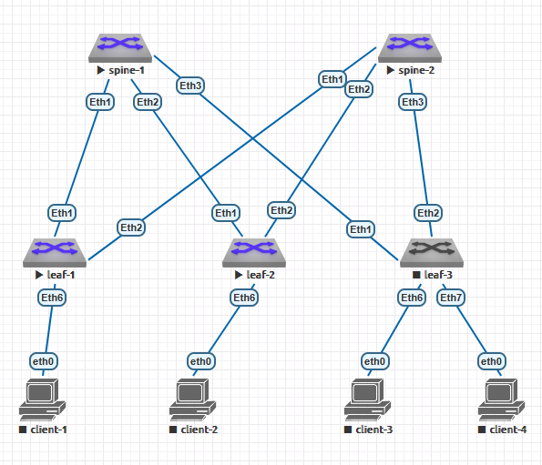

#  Домашнее задание №5
# VxLAN. L2 VNI
## по теме №11 "VxLAN. EVPN L2" 
### Цель: Настроить Overlay на основе VxLAN EVPN для L2 связанности между клиентами
### Задачи:
+ настроить BGP peering между Leaf и Spine в AF l2vpn evpn;
+ зафиксировать в документации - план работы, адресное пространство, схему сети, конфигурацию устройств.
## Практическая часть
#### Схема ЦОД
1. Схема сети



2. Адресное пространство для Underlay
+ Lo1 - 172.16.XNN.0/16, где X нечётный - spine, X чётный - leaf; N - номер коммутатора 
+ Lo2 - 172.17.XNN.0/16, где X нечётный - spine, X чётный - leaf; N - номер коммутатора
+ P2P links - 172.18.NNN.0/15, где N - номер коммутатора spine

Таблица адресов
  
| Hostname | Interface |  	IP/MASK    |	Description |
|----------|-----------|---------------|--------------|
|spine-1   |Eth1     |172.18.1.0/31  |-L- leaf-1    |
|spine-1   |Eth2     |172.18.1.2/31  |-L- leaf-2    |
|spine-1   |Eth3     |172.18.1.4/31  |-L- leaf-3    |
|spine-1   |L01        |172.16.101.1/32  |              |
|spine-1   |L02        |172.17.101.1/32|              |
|spine-2   |Eth1     |172.18.2.0/31  |-L- leaf-1    |
|spine-2   |Eth2     |172.18.2.2/31  |-L- leaf-2    |
|spine-2   |Eth3     |172.18.2.4/31  |-L- leaf-3    |
|spine-2   |L01        |172.16.102.1/32  |              |
|spine-2   |L02        |172.17.102.1/32|              |
|leaf-1    |Eth1     |172.18.1.1/31  |-L- spine-1    |
|leaf-1    |Eth2     |172.18.2.1/31  |-L- spine-2    |
|leaf-1    |L01        |172.16.201.1/32 |              |
|leaf-1    |L02        |172.17.201.1/32|              |
|leaf-2    |Eth1     |172.18.1.3/31  |-L- spine-1    |
|leaf-2    |Eth2     |172.18.2.3/31  |-L- spine-2    |
|leaf-2    |L01        |172.16.202.1/32 |              |
|leaf-2    |L02        |172.17.202.1/32|              |
|leaf-3    |Eth1     |172.18.1.5/31  |-L- spine-1    |
|leaf-3    |Eth2     |172.18.2.5/31  |-L- spine-2    |
|leaf-3    |L01        |172.16.203.1/32 |              |
|leaf-3    |L02        |172.17.203.1/32|              |
|client-1   |Eth        |192.168.0.1/24|              |
|client-2   |Eth        |192.168.0.2/24|              |
|client-3   |Eth        |192.168.0.3/24|              |
|client-4   |Eth        |192.168.0.4/24|              |

Для коммутаторов spine выбрана AS 65000, для коммутаторов leaf - соответственно по их номерам 650001, 65002, 65003.

3. Настройки оборудования приведены в соотвествующих текстовых файлах в этом каталоге, настройки клиентов приведены ниже:

**client-1**

```
client-1> show ip

NAME        : client-1[1]
IP/MASK     : 192.168.0.1/24
GATEWAY     : 0.0.0.0
DNS         :
MAC         : 00:50:79:66:68:06
LPORT       : 20000
RHOST:PORT  : 127.0.0.1:30000
MTU         : 1500
```

**client-2**

```
client-2> show ip

NAME        : client-2[1]
IP/MASK     : 192.168.0.2/24
GATEWAY     : 0.0.0.0
DNS         :
MAC         : 00:50:79:66:68:07
LPORT       : 20000
RHOST:PORT  : 127.0.0.1:30000
MTU         : 1500
```

**client-3**

```
client-3> show ip

NAME        : client-3[1]
IP/MASK     : 192.168.0.3/24
GATEWAY     : 0.0.0.0
DNS         :
MAC         : 00:50:79:66:68:08
LPORT       : 20000
RHOST:PORT  : 127.0.0.1:30000
MTU         : 1500
```

**client-4**

```
client-4> show ip

NAME        : client-4[1]
IP/MASK     : 192.168.0.4/24
GATEWAY     : 0.0.0.0
DNS         :
MAC         : 00:50:79:66:68:09
LPORT       : 20000
RHOST:PORT  : 127.0.0.1:30000
MTU         : 1500
```

4. Таблицы маршрутизации на коммутаторах:

**Коммутатор spine-1**

```
spine-1#show ip route

VRF: default
Codes: C - connected, S - static, K - kernel,
       O - OSPF, IA - OSPF inter area, E1 - OSPF external type 1,
       E2 - OSPF external type 2, N1 - OSPF NSSA external type 1,
       N2 - OSPF NSSA external type2, B - Other BGP Routes,
       B I - iBGP, B E - eBGP, R - RIP, I L1 - IS-IS level 1,
       I L2 - IS-IS level 2, O3 - OSPFv3, A B - BGP Aggregate,
       A O - OSPF Summary, NG - Nexthop Group Static Route,
       V - VXLAN Control Service, M - Martian,
       DH - DHCP client installed default route,
       DP - Dynamic Policy Route, L - VRF Leaked,
       G  - gRIBI, RC - Route Cache Route

Gateway of last resort is not set

 C        172.16.101.1/32 is directly connected, Loopback1
 B E      172.16.201.1/32 [200/0] via 172.18.1.1, Ethernet1
 B E      172.16.202.1/32 [200/0] via 172.18.1.3, Ethernet2
 B E      172.16.203.1/32 [200/0] via 172.18.1.5, Ethernet3
 C        172.17.101.1/32 is directly connected, Loopback2
 B E      172.17.201.1/32 [200/0] via 172.18.1.1, Ethernet1
 B E      172.17.202.1/32 [200/0] via 172.18.1.3, Ethernet2
 B E      172.17.203.1/32 [200/0] via 172.18.1.5, Ethernet3
 C        172.18.1.0/31 is directly connected, Ethernet1
 C        172.18.1.2/31 is directly connected, Ethernet2
 C        172.18.1.4/31 is directly connected, Ethernet3

spine-1#
```

**Коммутатор spine-2**

```
spine-2#show ip route

VRF: default
Codes: C - connected, S - static, K - kernel,
       O - OSPF, IA - OSPF inter area, E1 - OSPF external type 1,
       E2 - OSPF external type 2, N1 - OSPF NSSA external type 1,
       N2 - OSPF NSSA external type2, B - Other BGP Routes,
       B I - iBGP, B E - eBGP, R - RIP, I L1 - IS-IS level 1,
       I L2 - IS-IS level 2, O3 - OSPFv3, A B - BGP Aggregate,
       A O - OSPF Summary, NG - Nexthop Group Static Route,
       V - VXLAN Control Service, M - Martian,
       DH - DHCP client installed default route,
       DP - Dynamic Policy Route, L - VRF Leaked,
       G  - gRIBI, RC - Route Cache Route

Gateway of last resort is not set

 C        172.16.102.1/32 is directly connected, Loopback1
 B E      172.16.201.1/32 [200/0] via 172.18.2.1, Ethernet1
 B E      172.16.202.1/32 [200/0] via 172.18.2.3, Ethernet2
 B E      172.16.203.1/32 [200/0] via 172.18.2.5, Ethernet3
 C        172.17.102.1/32 is directly connected, Loopback2
 B E      172.17.201.1/32 [200/0] via 172.18.2.1, Ethernet1
 B E      172.17.202.1/32 [200/0] via 172.18.2.3, Ethernet2
 B E      172.17.203.1/32 [200/0] via 172.18.2.5, Ethernet3
 C        172.18.2.0/31 is directly connected, Ethernet1
 C        172.18.2.2/31 is directly connected, Ethernet2
 C        172.18.2.4/31 is directly connected, Ethernet3

spine-2#
```

**Коммутатор leaf-1**

```
leaf-1#show ip route

VRF: default
Codes: C - connected, S - static, K - kernel,
       O - OSPF, IA - OSPF inter area, E1 - OSPF external type 1,
       E2 - OSPF external type 2, N1 - OSPF NSSA external type 1,
       N2 - OSPF NSSA external type2, B - Other BGP Routes,
       B I - iBGP, B E - eBGP, R - RIP, I L1 - IS-IS level 1,
       I L2 - IS-IS level 2, O3 - OSPFv3, A B - BGP Aggregate,
       A O - OSPF Summary, NG - Nexthop Group Static Route,
       V - VXLAN Control Service, M - Martian,
       DH - DHCP client installed default route,
       DP - Dynamic Policy Route, L - VRF Leaked,
       G  - gRIBI, RC - Route Cache Route

Gateway of last resort is not set

 B E      172.16.101.1/32 [200/0] via 172.18.1.0, Ethernet1
 B E      172.16.102.1/32 [200/0] via 172.18.2.0, Ethernet2
 C        172.16.201.1/32 is directly connected, Loopback1
 B E      172.16.202.1/32 [200/0] via 172.18.1.0, Ethernet1
                                  via 172.18.2.0, Ethernet2
 B E      172.16.203.1/32 [200/0] via 172.18.1.0, Ethernet1
                                  via 172.18.2.0, Ethernet2
 B E      172.17.101.1/32 [200/0] via 172.18.1.0, Ethernet1
 B E      172.17.102.1/32 [200/0] via 172.18.2.0, Ethernet2
 C        172.17.201.1/32 is directly connected, Loopback2
 B E      172.17.202.1/32 [200/0] via 172.18.1.0, Ethernet1
                                  via 172.18.2.0, Ethernet2
 B E      172.17.203.1/32 [200/0] via 172.18.1.0, Ethernet1
                                  via 172.18.2.0, Ethernet2
 C        172.18.1.0/31 is directly connected, Ethernet1
 C        172.18.2.0/31 is directly connected, Ethernet2

leaf-1#
```

**Коммутатор leaf-2**

```
leaf-2#show ip route

VRF: default
Codes: C - connected, S - static, K - kernel,
       O - OSPF, IA - OSPF inter area, E1 - OSPF external type 1,
       E2 - OSPF external type 2, N1 - OSPF NSSA external type 1,
       N2 - OSPF NSSA external type2, B - Other BGP Routes,
       B I - iBGP, B E - eBGP, R - RIP, I L1 - IS-IS level 1,
       I L2 - IS-IS level 2, O3 - OSPFv3, A B - BGP Aggregate,
       A O - OSPF Summary, NG - Nexthop Group Static Route,
       V - VXLAN Control Service, M - Martian,
       DH - DHCP client installed default route,
       DP - Dynamic Policy Route, L - VRF Leaked,
       G  - gRIBI, RC - Route Cache Route

Gateway of last resort is not set

 B E      172.16.101.1/32 [200/0] via 172.18.1.2, Ethernet1
 B E      172.16.102.1/32 [200/0] via 172.18.2.2, Ethernet2
 B E      172.16.201.1/32 [200/0] via 172.18.1.2, Ethernet1
                                  via 172.18.2.2, Ethernet2
 C        172.16.202.1/32 is directly connected, Loopback1
 B E      172.16.203.1/32 [200/0] via 172.18.1.2, Ethernet1
                                  via 172.18.2.2, Ethernet2
 B E      172.17.101.1/32 [200/0] via 172.18.1.2, Ethernet1
 B E      172.17.102.1/32 [200/0] via 172.18.2.2, Ethernet2
 B E      172.17.201.1/32 [200/0] via 172.18.1.2, Ethernet1
                                  via 172.18.2.2, Ethernet2
 C        172.17.202.1/32 is directly connected, Loopback2
 B E      172.17.203.1/32 [200/0] via 172.18.1.2, Ethernet1
                                  via 172.18.2.2, Ethernet2
 C        172.18.1.2/31 is directly connected, Ethernet1
 C        172.18.2.2/31 is directly connected, Ethernet2

leaf-2#
```

**Коммутатор leaf-3**

```
leaf-3#show ip route

VRF: default
Codes: C - connected, S - static, K - kernel,
       O - OSPF, IA - OSPF inter area, E1 - OSPF external type 1,
       E2 - OSPF external type 2, N1 - OSPF NSSA external type 1,
       N2 - OSPF NSSA external type2, B - Other BGP Routes,
       B I - iBGP, B E - eBGP, R - RIP, I L1 - IS-IS level 1,
       I L2 - IS-IS level 2, O3 - OSPFv3, A B - BGP Aggregate,
       A O - OSPF Summary, NG - Nexthop Group Static Route,
       V - VXLAN Control Service, M - Martian,
       DH - DHCP client installed default route,
       DP - Dynamic Policy Route, L - VRF Leaked,
       G  - gRIBI, RC - Route Cache Route

Gateway of last resort is not set

 B E      172.16.101.1/32 [200/0] via 172.18.1.4, Ethernet1
 B E      172.16.102.1/32 [200/0] via 172.18.2.4, Ethernet2
 B E      172.16.201.1/32 [200/0] via 172.18.1.4, Ethernet1
                                  via 172.18.2.4, Ethernet2
 B E      172.16.202.1/32 [200/0] via 172.18.1.4, Ethernet1
                                  via 172.18.2.4, Ethernet2
 C        172.16.203.1/32 is directly connected, Loopback1
 B E      172.17.101.1/32 [200/0] via 172.18.1.4, Ethernet1
 B E      172.17.102.1/32 [200/0] via 172.18.2.4, Ethernet2
 B E      172.17.201.1/32 [200/0] via 172.18.1.4, Ethernet1
                                  via 172.18.2.4, Ethernet2
 B E      172.17.202.1/32 [200/0] via 172.18.1.4, Ethernet1
                                  via 172.18.2.4, Ethernet2
 C        172.17.203.1/32 is directly connected, Loopback2
 C        172.18.1.4/31 is directly connected, Ethernet1
 C        172.18.2.4/31 is directly connected, Ethernet2

leaf-3#
```

5. Проверка связности между клиентскими устройствами утилитой **ping**.

**client-1**

```
client-1> ping 192.168.0.2

84 bytes from 192.168.0.2 icmp_seq=1 ttl=64 time=32.128 ms
84 bytes from 192.168.0.2 icmp_seq=2 ttl=64 time=31.835 ms
84 bytes from 192.168.0.2 icmp_seq=3 ttl=64 time=32.857 ms
84 bytes from 192.168.0.2 icmp_seq=4 ttl=64 time=42.356 ms
84 bytes from 192.168.0.2 icmp_seq=5 ttl=64 time=30.261 ms

client-1> ping 192.168.0.3

84 bytes from 192.168.0.3 icmp_seq=1 ttl=64 time=40.211 ms
84 bytes from 192.168.0.3 icmp_seq=2 ttl=64 time=43.224 ms
84 bytes from 192.168.0.3 icmp_seq=3 ttl=64 time=143.691 ms
84 bytes from 192.168.0.3 icmp_seq=4 ttl=64 time=36.844 ms
84 bytes from 192.168.0.3 icmp_seq=5 ttl=64 time=35.865 ms

client-1> ping 192.168.0.4

84 bytes from 192.168.0.4 icmp_seq=1 ttl=64 time=44.362 ms
84 bytes from 192.168.0.4 icmp_seq=2 ttl=64 time=30.546 ms
84 bytes from 192.168.0.4 icmp_seq=3 ttl=64 time=37.396 ms
84 bytes from 192.168.0.4 icmp_seq=4 ttl=64 time=33.088 ms
84 bytes from 192.168.0.4 icmp_seq=5 ttl=64 time=40.510 ms
```

**client-2**

```
client-2> ping 192.168.0.1

84 bytes from 192.168.0.1 icmp_seq=1 ttl=64 time=35.314 ms
84 bytes from 192.168.0.1 icmp_seq=2 ttl=64 time=37.119 ms
84 bytes from 192.168.0.1 icmp_seq=3 ttl=64 time=36.233 ms
84 bytes from 192.168.0.1 icmp_seq=4 ttl=64 time=37.552 ms
84 bytes from 192.168.0.1 icmp_seq=5 ttl=64 time=37.323 ms

client-2> ping 192.168.0.4

84 bytes from 192.168.0.4 icmp_seq=1 ttl=64 time=38.056 ms
84 bytes from 192.168.0.4 icmp_seq=2 ttl=64 time=50.732 ms
84 bytes from 192.168.0.4 icmp_seq=3 ttl=64 time=42.052 ms
84 bytes from 192.168.0.4 icmp_seq=4 ttl=64 time=37.738 ms
84 bytes from 192.168.0.4 icmp_seq=5 ttl=64 time=35.355 ms

client-2> ping 192.168.0.3

84 bytes from 192.168.0.3 icmp_seq=1 ttl=64 time=33.578 ms
84 bytes from 192.168.0.3 icmp_seq=2 ttl=64 time=41.683 ms
84 bytes from 192.168.0.3 icmp_seq=3 ttl=64 time=48.181 ms
84 bytes from 192.168.0.3 icmp_seq=4 ttl=64 time=36.934 ms
84 bytes from 192.168.0.3 icmp_seq=5 ttl=64 time=33.034 ms
```


**client-3**

```
client-3> ping 192.168.0.1

84 bytes from 192.168.0.1 icmp_seq=1 ttl=64 time=40.824 ms
84 bytes from 192.168.0.1 icmp_seq=2 ttl=64 time=35.768 ms
84 bytes from 192.168.0.1 icmp_seq=3 ttl=64 time=47.706 ms
84 bytes from 192.168.0.1 icmp_seq=4 ttl=64 time=36.131 ms
84 bytes from 192.168.0.1 icmp_seq=5 ttl=64 time=36.016 ms

client-3> ping 192.168.0.2

84 bytes from 192.168.0.2 icmp_seq=1 ttl=64 time=39.184 ms
84 bytes from 192.168.0.2 icmp_seq=2 ttl=64 time=34.451 ms
84 bytes from 192.168.0.2 icmp_seq=3 ttl=64 time=38.735 ms
84 bytes from 192.168.0.2 icmp_seq=4 ttl=64 time=33.742 ms
84 bytes from 192.168.0.2 icmp_seq=5 ttl=64 time=38.760 ms

client-3> ping 192.168.0.4

84 bytes from 192.168.0.4 icmp_seq=1 ttl=64 time=11.959 ms
84 bytes from 192.168.0.4 icmp_seq=2 ttl=64 time=9.268 ms
84 bytes from 192.168.0.4 icmp_seq=3 ttl=64 time=10.094 ms
84 bytes from 192.168.0.4 icmp_seq=4 ttl=64 time=12.839 ms
84 bytes from 192.168.0.4 icmp_seq=5 ttl=64 time=10.230 ms
```

**client-4**

```
client-4> ping 192.168.0.3

84 bytes from 192.168.0.3 icmp_seq=1 ttl=64 time=158.707 ms
84 bytes from 192.168.0.3 icmp_seq=2 ttl=64 time=11.091 ms
84 bytes from 192.168.0.3 icmp_seq=3 ttl=64 time=13.027 ms
84 bytes from 192.168.0.3 icmp_seq=4 ttl=64 time=13.996 ms
84 bytes from 192.168.0.3 icmp_seq=5 ttl=64 time=10.643 ms

client-4> ping 192.168.0.2

84 bytes from 192.168.0.2 icmp_seq=1 ttl=64 time=109.527 ms
84 bytes from 192.168.0.2 icmp_seq=2 ttl=64 time=38.904 ms
84 bytes from 192.168.0.2 icmp_seq=3 ttl=64 time=38.122 ms
84 bytes from 192.168.0.2 icmp_seq=4 ttl=64 time=38.435 ms
84 bytes from 192.168.0.2 icmp_seq=5 ttl=64 time=37.562 ms

client-4> ping 192.168.0.1

84 bytes from 192.168.0.1 icmp_seq=1 ttl=64 time=90.992 ms
84 bytes from 192.168.0.1 icmp_seq=2 ttl=64 time=54.431 ms
84 bytes from 192.168.0.1 icmp_seq=3 ttl=64 time=34.148 ms
84 bytes from 192.168.0.1 icmp_seq=4 ttl=64 time=38.755 ms
84 bytes from 192.168.0.1 icmp_seq=5 ttl=64 time=36.173 ms
```


