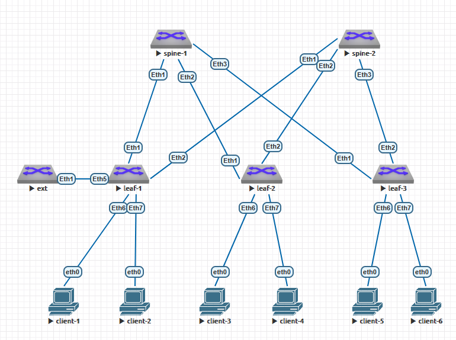

#  Домашнее задание №8
# VxLAN. Routing
## по теме №15 "VxLAN. Оптимизация таблиц маршрутизации" 
### Цель: Реализовать передачу суммарных префиксов через EVPN route-type 5
### Задачи:
+ подключить двух "клиентов" в разных VRF в рамках одной фабрики;
+ маршрутизацию между клиентами через внешнее устройство (граничный роутер\фаерволл\etc);
+ зафиксировать в документации - план работы, адресное пространство, схему сети, конфигурацию устройств.
## Практическая часть
#### Схема ЦОД
1. Схема сети



2. Адресное пространство для Underlay
+ Lo1 - 172.16.XNN.0/16, где X нечётный - spine, X чётный - leaf; N - номер коммутатора 
+ Lo2 - 172.17.XNN.0/16, где X нечётный - spine, X чётный - leaf; N - номер коммутатора
+ P2P links - 172.18.NNN.0/15, где N - номер коммутатора spine

Таблица адресов
  
| Hostname | Interface |  	IP/MASK    |	Description |
|----------|-----------|---------------|--------------|
|spine-1   |Eth1     |172.18.1.0/31  |-L- leaf-1    |
|spine-1   |Eth2     |172.18.1.2/31  |-L- leaf-2    |
|spine-1   |Eth3     |172.18.1.4/31  |-L- leaf-3    |
|spine-1   |L01        |172.16.101.1/32  |           |
|spine-1   |L02        |172.17.101.1/32|             |
|spine-2   |Eth1     |172.18.2.0/31  |-L- leaf-1    |
|spine-2   |Eth2     |172.18.2.2/31  |-L- leaf-2    |
|spine-2   |Eth3     |172.18.2.4/31  |-L- leaf-3    |
|spine-2   |L01        |172.16.102.1/32  |            |
|spine-2   |L02        |172.17.102.1/32|              |
|leaf-1    |Eth1     |172.18.1.1/31  |-S- spine-1    |
|leaf-1    |Eth2     |172.18.2.1/31  |-S- spine-2    |
|leaf-1    |Eth5     |               |to_ext |
|leaf-1    |Eth6     |               |to_client-1 |
|leaf-1    |Eth7     |               |to_client-2 |
|leaf-1    |L01        |172.16.201.1/32 |              |
|leaf-1    |L02        |172.17.201.1/32|              |
|leaf-1    |Vlan10   |192.168.10.254/24|              |
|leaf-1    |Vlan11   |192.168.11.254/24|              |
|leaf-1    |Vlan100   |100.100.100.100/24|              |
|leaf-1    |Vlan101  |101.101.101.101/24|              |
|leaf-2    |Eth1     |172.18.1.3/31  |-S- spine-1    |
|leaf-2    |Eth2     |172.18.2.3/31  |-S- spine-2    |
|leaf-2    |Eth6     |               |to_client-3 |
|leaf-2    |Eth7     |               |to_client-4 |
|leaf-2    |L01        |172.16.202.1/32 |              |
|leaf-2    |L02        |172.17.202.1/32|              |
|leaf-3    |Eth1     |172.18.1.5/31  |-S- spine-1    |
|leaf-3    |Eth2     |172.18.2.5/31  |-S- spine-2    |
|leaf-3    |Eth6     |               |to_client-5  |
|leaf-3    |Eth7     |               |to_client-6  |
|leaf-3    |L01        |172.16.203.1/32 |              |
|leaf-3    |L02        |172.17.203.1/32|              |
|client-1   |Eth        |192.168.10.1/24|              |
|client-2   |Eth        |192.168.11.1/24|              |
|client-3   |Eth        |192.168.10.2/24|              |
|client-4   |Eth        |101.101.101.1/24|              |
|client-5   |Eth        |192.168.10.3/24|              |
|client-6   |Eth        |192.168.11.2/24|              |

Для коммутаторов spine выбрана AS 65000, для коммутаторов leaf - соответственно по их номерам 65001, 65002, 65003.

3. Настройки оборудования приведены в соотвествующих текстовых файлах в этом каталоге, настройки клиентов приведены ниже:

**client-1**

```
client-1> show ip

NAME        : client-1[1]
IP/MASK     : 192.168.10.1/24
GATEWAY     : 192.168.10.254
DNS         :
MAC         : 00:50:79:66:68:06
LPORT       : 20000
RHOST:PORT  : 127.0.0.1:30000
MTU         : 1500
```

**client-2**

```
client-2> show ip

NAME        : client-2[1]
IP/MASK     : 192.168.11.1/24
GATEWAY     : 192.168.11.254
DNS         :
MAC         : 00:50:79:66:68:07
LPORT       : 20000
RHOST:PORT  : 127.0.0.1:30000
MTU         : 1500
```

**client-3**

```
client-3> show ip

NAME        : client-3[1]
IP/MASK     : 192.168.10.2/24
GATEWAY     : 192.168.10.254
DNS         :
MAC         : 00:50:79:66:68:08
LPORT       : 20000
RHOST:PORT  : 127.0.0.1:30000
MTU         : 1500
```

**client-4**

```
client-4> show ip

NAME        : client-4[1]
IP/MASK     : 101.101.101.1/24
GATEWAY     : 101.101.101.101
DNS         :
MAC         : 00:50:79:66:68:09
LPORT       : 20000
RHOST:PORT  : 127.0.0.1:30000
MTU         : 1500
```

**client-5**

```
clent-5> show ip

NAME        : clent-5[1]
IP/MASK     : 192.168.10.3/24
GATEWAY     : 192.168.10.254
DNS         :
MAC         : 00:50:79:66:68:0b
LPORT       : 20000
RHOST:PORT  : 127.0.0.1:30000
MTU         : 1500
```

**client-6**

```
client-6> show ip

NAME        : client-6[1]
IP/MASK     : 192.168.11.2/24
GATEWAY     : 192.168.11.254
DNS         :
MAC         : 00:50:79:66:68:0c
LPORT       : 20000
RHOST:PORT  : 127.0.0.1:30000
MTU         : 1500
```

4. Таблицы маршрутизации на коммутаторах:

**Коммутатор leaf-1**

```
leaf-1#
leaf-1#show ip route vrf OTUS

VRF: OTUS
Codes: C - connected, S - static, K - kernel,
       O - OSPF, IA - OSPF inter area, E1 - OSPF external type 1,
       E2 - OSPF external type 2, N1 - OSPF NSSA external type 1,
       N2 - OSPF NSSA external type2, B - Other BGP Routes,
       B I - iBGP, B E - eBGP, R - RIP, I L1 - IS-IS level 1,
       I L2 - IS-IS level 2, O3 - OSPFv3, A B - BGP Aggregate,
       A O - OSPF Summary, NG - Nexthop Group Static Route,
       V - VXLAN Control Service, M - Martian,
       DH - DHCP client installed default route,
       DP - Dynamic Policy Route, L - VRF Leaked,
       G  - gRIBI, RC - Route Cache Route

Gateway of last resort:
 B E      0.0.0.0/0 [200/0] via 100.100.100.99, Vlan100

 B E      5.5.5.5/32 [200/0] via 100.100.100.99, Vlan100
 C        100.100.100.0/24 is directly connected, Vlan100
 B E      101.101.101.0/24 [200/0] via 100.100.100.99, Vlan100
 B E      192.168.0.0/24 [200/0] via VTEP 172.17.202.1 VNI 20000 router-mac 50:00:00:03:37:66 local-interface Vxlan1
 C        192.168.10.0/24 is directly connected, Vlan10
 C        192.168.11.0/24 is directly connected, Vlan11

leaf-1#show ip route vrf OTUS2

VRF: OTUS2
Codes: C - connected, S - static, K - kernel,
       O - OSPF, IA - OSPF inter area, E1 - OSPF external type 1,
       E2 - OSPF external type 2, N1 - OSPF NSSA external type 1,
       N2 - OSPF NSSA external type2, B - Other BGP Routes,
       B I - iBGP, B E - eBGP, R - RIP, I L1 - IS-IS level 1,
       I L2 - IS-IS level 2, O3 - OSPFv3, A B - BGP Aggregate,
       A O - OSPF Summary, NG - Nexthop Group Static Route,
       V - VXLAN Control Service, M - Martian,
       DH - DHCP client installed default route,
       DP - Dynamic Policy Route, L - VRF Leaked,
       G  - gRIBI, RC - Route Cache Route

Gateway of last resort:
 B E      0.0.0.0/0 [200/0] via 101.101.101.100, Vlan101

 B E      5.5.5.5/32 [200/0] via 101.101.101.100, Vlan101
 B E      100.100.100.0/24 [200/0] via 101.101.101.100, Vlan101
 C        101.101.101.0/24 is directly connected, Vlan101

leaf-1#
```

**Коммутатор leaf-2**

```
leaf-2#show ip route vrf OTUS

VRF: OTUS
Codes: C - connected, S - static, K - kernel,
       O - OSPF, IA - OSPF inter area, E1 - OSPF external type 1,
       E2 - OSPF external type 2, N1 - OSPF NSSA external type 1,
       N2 - OSPF NSSA external type2, B - Other BGP Routes,
       B I - iBGP, B E - eBGP, R - RIP, I L1 - IS-IS level 1,
       I L2 - IS-IS level 2, O3 - OSPFv3, A B - BGP Aggregate,
       A O - OSPF Summary, NG - Nexthop Group Static Route,
       V - VXLAN Control Service, M - Martian,
       DH - DHCP client installed default route,
       DP - Dynamic Policy Route, L - VRF Leaked,
       G  - gRIBI, RC - Route Cache Route

Gateway of last resort:
 B E      0.0.0.0/0 [200/0] via VTEP 172.17.201.1 VNI 20000 router-mac 50:00:00:d5:5d:c0 local-interface Vxlan1

 B E      5.5.5.5/32 [200/0] via VTEP 172.17.201.1 VNI 20000 router-mac 50:00:00:d5:5d:c0 local-interface Vxlan1
 B E      100.100.100.0/24 [200/0] via VTEP 172.17.201.1 VNI 20000 router-mac 50:00:00:d5:5d:c0 local-interface Vxlan1
 B E      101.101.101.0/24 [200/0] via VTEP 172.17.201.1 VNI 20000 router-mac 50:00:00:d5:5d:c0 local-interface Vxlan1
 C        192.168.0.0/24 is directly connected, Vlan10
 B E      192.168.10.1/32 [200/0] via VTEP 172.17.201.1 VNI 20000 router-mac 50:00:00:d5:5d:c0 local-interface Vxlan1
 B E      192.168.10.0/24 [200/0] via VTEP 172.17.201.1 VNI 20000 router-mac 50:00:00:d5:5d:c0 local-interface Vxlan1
 B E      192.168.11.1/32 [200/0] via VTEP 172.17.201.1 VNI 20000 router-mac 50:00:00:d5:5d:c0 local-interface Vxlan1
 B E      192.168.11.0/24 [200/0] via VTEP 172.17.201.1 VNI 20000 router-mac 50:00:00:d5:5d:c0 local-interface Vxlan1

leaf-2#
```

**Коммутатор leaf-3**

```
leaf-3#show ip route vrf OTUS

VRF: OTUS
Codes: C - connected, S - static, K - kernel,
       O - OSPF, IA - OSPF inter area, E1 - OSPF external type 1,
       E2 - OSPF external type 2, N1 - OSPF NSSA external type 1,
       N2 - OSPF NSSA external type2, B - Other BGP Routes,
       B I - iBGP, B E - eBGP, R - RIP, I L1 - IS-IS level 1,
       I L2 - IS-IS level 2, O3 - OSPFv3, A B - BGP Aggregate,
       A O - OSPF Summary, NG - Nexthop Group Static Route,
       V - VXLAN Control Service, M - Martian,
       DH - DHCP client installed default route,
       DP - Dynamic Policy Route, L - VRF Leaked,
       G  - gRIBI, RC - Route Cache Route

Gateway of last resort:
 B E      0.0.0.0/0 [200/0] via VTEP 172.17.201.1 VNI 20000 router-mac 50:00:00:d5:5d:c0 local-interface Vxlan1

 B E      5.5.5.5/32 [200/0] via VTEP 172.17.201.1 VNI 20000 router-mac 50:00:00:d5:5d:c0 local-interface Vxlan1
 B E      100.100.100.0/24 [200/0] via VTEP 172.17.201.1 VNI 20000 router-mac 50:00:00:d5:5d:c0 local-interface Vxlan1
 B E      101.101.101.0/24 [200/0] via VTEP 172.17.201.1 VNI 20000 router-mac 50:00:00:d5:5d:c0 local-interface Vxlan1
 B E      192.168.0.0/24 [200/0] via VTEP 172.17.202.1 VNI 20000 router-mac 50:00:00:03:37:66 local-interface Vxlan1
 B E      192.168.10.1/32 [200/0] via VTEP 172.17.201.1 VNI 20000 router-mac 50:00:00:d5:5d:c0 local-interface Vxlan1
 B E      192.168.10.0/24 [200/0] via VTEP 172.17.201.1 VNI 20000 router-mac 50:00:00:d5:5d:c0 local-interface Vxlan1
 B E      192.168.11.1/32 [200/0] via VTEP 172.17.201.1 VNI 20000 router-mac 50:00:00:d5:5d:c0 local-interface Vxlan1
 B E      192.168.11.0/24 [200/0] via VTEP 172.17.201.1 VNI 20000 router-mac 50:00:00:d5:5d:c0 local-interface Vxlan1

leaf-3#
```

**Коммутатор ext**

```
ext#sh ip route

VRF: default
Codes: C - connected, S - static, K - kernel,
       O - OSPF, IA - OSPF inter area, E1 - OSPF external type 1,
       E2 - OSPF external type 2, N1 - OSPF NSSA external type 1,
       N2 - OSPF NSSA external type2, B - Other BGP Routes,
       B I - iBGP, B E - eBGP, R - RIP, I L1 - IS-IS level 1,
       I L2 - IS-IS level 2, O3 - OSPFv3, A B - BGP Aggregate,
       A O - OSPF Summary, NG - Nexthop Group Static Route,
       V - VXLAN Control Service, M - Martian,
       DH - DHCP client installed default route,
       DP - Dynamic Policy Route, L - VRF Leaked,
       G  - gRIBI, RC - Route Cache Route

Gateway of last resort:
 S        0.0.0.0/0 is directly connected, Null0

 C        5.5.5.5/32 is directly connected, Loopback1
 C        100.100.100.0/24 is directly connected, Vlan100
 C        101.101.101.0/24 is directly connected, Vlan101
 B E      192.168.0.0/24 [200/0] via 100.100.100.100, Vlan100
 B E      192.168.10.0/24 [200/0] via 100.100.100.100, Vlan100
 B E      192.168.11.0/24 [200/0] via 100.100.100.100, Vlan100

ext#
```

5. Проверка дополнительных настроек BGP и EVPN

**Коммутатор leaf-1**

```
leaf-1#show bgp evpn route-type ip-prefix ipv4
BGP routing table information for VRF default
Router identifier 172.16.201.1, local AS number 65001
Route status codes: * - valid, > - active, S - Stale, E - ECMP head, e - ECMP
                    c - Contributing to ECMP, % - Pending BGP convergence
Origin codes: i - IGP, e - EGP, ? - incomplete
AS Path Attributes: Or-ID - Originator ID, C-LST - Cluster List, LL Nexthop - Link Local Nexthop

          Network                Next Hop              Metric  LocPref Weight  Path
 * >      RD: 65001:101 ip-prefix 0.0.0.0/0
                                 -                     -       100     0       65050 ?
 * >      RD: 65001:20000 ip-prefix 0.0.0.0/0
                                 -                     -       100     0       65050 ?
 * >      RD: 65001:101 ip-prefix 5.5.5.5/32
                                 -                     -       100     0       65050 i
 * >      RD: 65001:20000 ip-prefix 5.5.5.5/32
                                 -                     -       100     0       65050 i
 * >      RD: 65001:101 ip-prefix 100.100.100.0/24
                                 -                     -       100     0       65050 i
 * >      RD: 65001:20000 ip-prefix 100.100.100.0/24
                                 -                     -       -       0       i
 *        RD: 65001:20000 ip-prefix 100.100.100.0/24
                                 -                     -       100     0       65050 i
 * >      RD: 65001:101 ip-prefix 101.101.101.0/24
                                 -                     -       -       0       i
 *        RD: 65001:101 ip-prefix 101.101.101.0/24
                                 -                     -       100     0       65050 i
 * >      RD: 65001:20000 ip-prefix 101.101.101.0/24
                                 -                     -       100     0       65050 i
 * >Ec    RD: 65002:20000 ip-prefix 192.168.0.0/24
                                 172.17.202.1          -       100     0       65000 65002 i
 *  ec    RD: 65002:20000 ip-prefix 192.168.0.0/24
                                 172.17.202.1          -       100     0       65000 65002 i
 * >      RD: 65001:20000 ip-prefix 192.168.10.0/24
                                 -                     -       -       0       i
 * >      RD: 65001:20000 ip-prefix 192.168.11.0/24
                                 -                     -       -       0       i
leaf-1#
```

**Коммутатор leaf-2**

```
leaf-2#show bgp evpn route-type ip-prefix ipv4
BGP routing table information for VRF default
Router identifier 172.16.202.1, local AS number 65002
Route status codes: * - valid, > - active, S - Stale, E - ECMP head, e - ECMP
                    c - Contributing to ECMP, % - Pending BGP convergence
Origin codes: i - IGP, e - EGP, ? - incomplete
AS Path Attributes: Or-ID - Originator ID, C-LST - Cluster List, LL Nexthop - Link Local Nexthop

          Network                Next Hop              Metric  LocPref Weight  Path
 * >Ec    RD: 65001:101 ip-prefix 0.0.0.0/0
                                 172.17.201.1          -       100     0       65000 65001 65050 ?
 *  ec    RD: 65001:101 ip-prefix 0.0.0.0/0
                                 172.17.201.1          -       100     0       65000 65001 65050 ?
 * >Ec    RD: 65001:20000 ip-prefix 0.0.0.0/0
                                 172.17.201.1          -       100     0       65000 65001 65050 ?
 *  ec    RD: 65001:20000 ip-prefix 0.0.0.0/0
                                 172.17.201.1          -       100     0       65000 65001 65050 ?
 * >Ec    RD: 65001:101 ip-prefix 5.5.5.5/32
                                 172.17.201.1          -       100     0       65000 65001 65050 i
 *  ec    RD: 65001:101 ip-prefix 5.5.5.5/32
                                 172.17.201.1          -       100     0       65000 65001 65050 i
 * >Ec    RD: 65001:20000 ip-prefix 5.5.5.5/32
                                 172.17.201.1          -       100     0       65000 65001 65050 i
 *  ec    RD: 65001:20000 ip-prefix 5.5.5.5/32
                                 172.17.201.1          -       100     0       65000 65001 65050 i
 * >Ec    RD: 65001:101 ip-prefix 100.100.100.0/24
                                 172.17.201.1          -       100     0       65000 65001 65050 i
 *  ec    RD: 65001:101 ip-prefix 100.100.100.0/24
                                 172.17.201.1          -       100     0       65000 65001 65050 i
 * >Ec    RD: 65001:20000 ip-prefix 100.100.100.0/24
                                 172.17.201.1          -       100     0       65000 65001 i
 *  ec    RD: 65001:20000 ip-prefix 100.100.100.0/24
                                 172.17.201.1          -       100     0       65000 65001 i
 * >Ec    RD: 65001:101 ip-prefix 101.101.101.0/24
                                 172.17.201.1          -       100     0       65000 65001 i
 *  ec    RD: 65001:101 ip-prefix 101.101.101.0/24
                                 172.17.201.1          -       100     0       65000 65001 i
 * >Ec    RD: 65001:20000 ip-prefix 101.101.101.0/24
                                 172.17.201.1          -       100     0       65000 65001 65050 i
 *  ec    RD: 65001:20000 ip-prefix 101.101.101.0/24
                                 172.17.201.1          -       100     0       65000 65001 65050 i
 * >      RD: 65002:20000 ip-prefix 192.168.0.0/24
                                 -                     -       -       0       i
 * >Ec    RD: 65001:20000 ip-prefix 192.168.10.0/24
                                 172.17.201.1          -       100     0       65000 65001 i
 *  ec    RD: 65001:20000 ip-prefix 192.168.10.0/24
                                 172.17.201.1          -       100     0       65000 65001 i
 * >Ec    RD: 65001:20000 ip-prefix 192.168.11.0/24
                                 172.17.201.1          -       100     0       65000 65001 i
 *  ec    RD: 65001:20000 ip-prefix 192.168.11.0/24
                                 172.17.201.1          -       100     0       65000 65001 i
leaf-2#
```

**Коммутатор leaf-3**

```
leaf-3#
leaf-3#show bgp evpn route-type ip-prefix ipv4
BGP routing table information for VRF default
Router identifier 172.16.203.1, local AS number 65003
Route status codes: * - valid, > - active, S - Stale, E - ECMP head, e - ECMP
                    c - Contributing to ECMP, % - Pending BGP convergence
Origin codes: i - IGP, e - EGP, ? - incomplete
AS Path Attributes: Or-ID - Originator ID, C-LST - Cluster List, LL Nexthop - Link Local Nexthop

          Network                Next Hop              Metric  LocPref Weight  Path
 * >Ec    RD: 65001:101 ip-prefix 0.0.0.0/0
                                 172.17.201.1          -       100     0       65000 65001 65050 ?
 *  ec    RD: 65001:101 ip-prefix 0.0.0.0/0
                                 172.17.201.1          -       100     0       65000 65001 65050 ?
 * >Ec    RD: 65001:20000 ip-prefix 0.0.0.0/0
                                 172.17.201.1          -       100     0       65000 65001 65050 ?
 *  ec    RD: 65001:20000 ip-prefix 0.0.0.0/0
                                 172.17.201.1          -       100     0       65000 65001 65050 ?
 * >Ec    RD: 65001:101 ip-prefix 5.5.5.5/32
                                 172.17.201.1          -       100     0       65000 65001 65050 i
 *  ec    RD: 65001:101 ip-prefix 5.5.5.5/32
                                 172.17.201.1          -       100     0       65000 65001 65050 i
 * >Ec    RD: 65001:20000 ip-prefix 5.5.5.5/32
                                 172.17.201.1          -       100     0       65000 65001 65050 i
 *  ec    RD: 65001:20000 ip-prefix 5.5.5.5/32
                                 172.17.201.1          -       100     0       65000 65001 65050 i
 * >Ec    RD: 65001:101 ip-prefix 100.100.100.0/24
                                 172.17.201.1          -       100     0       65000 65001 65050 i
 *  ec    RD: 65001:101 ip-prefix 100.100.100.0/24
                                 172.17.201.1          -       100     0       65000 65001 65050 i
 * >Ec    RD: 65001:20000 ip-prefix 100.100.100.0/24
                                 172.17.201.1          -       100     0       65000 65001 i
 *  ec    RD: 65001:20000 ip-prefix 100.100.100.0/24
                                 172.17.201.1          -       100     0       65000 65001 i
 * >Ec    RD: 65001:101 ip-prefix 101.101.101.0/24
                                 172.17.201.1          -       100     0       65000 65001 i
 *  ec    RD: 65001:101 ip-prefix 101.101.101.0/24
                                 172.17.201.1          -       100     0       65000 65001 i
 * >Ec    RD: 65001:20000 ip-prefix 101.101.101.0/24
                                 172.17.201.1          -       100     0       65000 65001 65050 i
 *  ec    RD: 65001:20000 ip-prefix 101.101.101.0/24
                                 172.17.201.1          -       100     0       65000 65001 65050 i
 * >Ec    RD: 65002:20000 ip-prefix 192.168.0.0/24
                                 172.17.202.1          -       100     0       65000 65002 i
 *  ec    RD: 65002:20000 ip-prefix 192.168.0.0/24
                                 172.17.202.1          -       100     0       65000 65002 i
 * >Ec    RD: 65001:20000 ip-prefix 192.168.10.0/24
                                 172.17.201.1          -       100     0       65000 65001 i
 *  ec    RD: 65001:20000 ip-prefix 192.168.10.0/24
                                 172.17.201.1          -       100     0       65000 65001 i
 * >Ec    RD: 65001:20000 ip-prefix 192.168.11.0/24
                                 172.17.201.1          -       100     0       65000 65001 i
 *  ec    RD: 65001:20000 ip-prefix 192.168.11.0/24
                                 172.17.201.1          -       100     0       65000 65001 i
leaf-3#
```


7. Проверка связности между клиентскими устройствами утилитой **ping**.

**srv**

```
srv#ping 192.168.0.3
PING 192.168.0.3 (192.168.0.3) 72(100) bytes of data.
80 bytes from 192.168.0.3: icmp_seq=1 ttl=64 time=92.1 ms
80 bytes from 192.168.0.3: icmp_seq=2 ttl=64 time=85.8 ms
80 bytes from 192.168.0.3: icmp_seq=3 ttl=64 time=83.8 ms
80 bytes from 192.168.0.3: icmp_seq=4 ttl=64 time=81.1 ms
80 bytes from 192.168.0.3: icmp_seq=5 ttl=64 time=77.6 ms

--- 192.168.0.3 ping statistics ---
5 packets transmitted, 5 received, 0% packet loss, time 52ms
rtt min/avg/max/mdev = 77.683/84.127/92.122/4.847 ms, pipe 5, ipg/ewma 13.101/87.799 ms
srv#

srv#ping 192.168.1.3
PING 192.168.1.3 (192.168.1.3) 72(100) bytes of data.
80 bytes from 192.168.1.3: icmp_seq=1 ttl=64 time=44.8 ms
80 bytes from 192.168.1.3: icmp_seq=2 ttl=64 time=51.3 ms
80 bytes from 192.168.1.3: icmp_seq=3 ttl=64 time=54.6 ms
80 bytes from 192.168.1.3: icmp_seq=4 ttl=64 time=62.9 ms
80 bytes from 192.168.1.3: icmp_seq=5 ttl=64 time=81.8 ms

--- 192.168.1.3 ping statistics ---
5 packets transmitted, 5 received, 0% packet loss, time 91ms
rtt min/avg/max/mdev = 44.891/59.136/81.849/12.768 ms, pipe 4, ipg/ewma 22.895/52.961 ms
```

**client-3**

```

client-3> ping 192.168.0.2

84 bytes from 192.168.0.2 icmp_seq=1 ttl=64 time=49.733 ms
84 bytes from 192.168.0.2 icmp_seq=2 ttl=64 time=75.222 ms
84 bytes from 192.168.0.2 icmp_seq=3 ttl=64 time=46.064 ms
84 bytes from 192.168.0.2 icmp_seq=4 ttl=64 time=39.158 ms
84 bytes from 192.168.0.2 icmp_seq=5 ttl=64 time=46.079 ms

client-3> ping 192.168.1.2

192.168.1.2 icmp_seq=1 timeout
84 bytes from 192.168.1.2 icmp_seq=2 ttl=64 time=92.218 ms
84 bytes from 192.168.1.2 icmp_seq=3 ttl=64 time=92.264 ms
84 bytes from 192.168.1.2 icmp_seq=4 ttl=64 time=94.178 ms
84 bytes from 192.168.1.2 icmp_seq=5 ttl=64 time=94.797 ms
84 bytes from 192.168.1.2 icmp_seq=5 ttl=64 time=93.587 ms


client-3> ping 192.168.1.3

84 bytes from 192.168.1.3 icmp_seq=1 ttl=63 time=15.532 ms
84 bytes from 192.168.1.3 icmp_seq=2 ttl=63 time=16.716 ms
84 bytes from 192.168.1.3 icmp_seq=3 ttl=63 time=16.618 ms
84 bytes from 192.168.1.3 icmp_seq=4 ttl=63 time=15.257 ms
84 bytes from 192.168.1.3 icmp_seq=5 ttl=63 time=18.782 ms

client-3>
```

**client-4**

```
client-4> ping 192.168.1.2

84 bytes from 192.168.1.2 icmp_seq=1 ttl=64 time=55.722 ms
84 bytes from 192.168.1.2 icmp_seq=2 ttl=64 time=52.953 ms
84 bytes from 192.168.1.2 icmp_seq=3 ttl=64 time=59.413 ms
84 bytes from 192.168.1.2 icmp_seq=4 ttl=64 time=100.454 ms
84 bytes from 192.168.1.2 icmp_seq=5 ttl=64 time=42.188 ms


client-4> ping 192.168.0.3

84 bytes from 192.168.0.3 icmp_seq=1 ttl=63 time=39.631 ms
84 bytes from 192.168.0.3 icmp_seq=2 ttl=63 time=18.465 ms
84 bytes from 192.168.0.3 icmp_seq=3 ttl=63 time=26.007 ms
84 bytes from 192.168.0.3 icmp_seq=4 ttl=63 time=17.723 ms
84 bytes from 192.168.0.3 icmp_seq=5 ttl=63 time=24.755 ms


client-4> ping 192.168.0.2

84 bytes from 192.168.0.2 icmp_seq=1 ttl=64 time=773.491 ms
84 bytes from 192.168.0.2 icmp_seq=2 ttl=64 time=111.783 ms
84 bytes from 192.168.0.2 icmp_seq=3 ttl=64 time=51.146 ms
84 bytes from 192.168.0.2 icmp_seq=4 ttl=64 time=46.040 ms
84 bytes from 192.168.0.2 icmp_seq=5 ttl=64 time=45.165 ms
```


