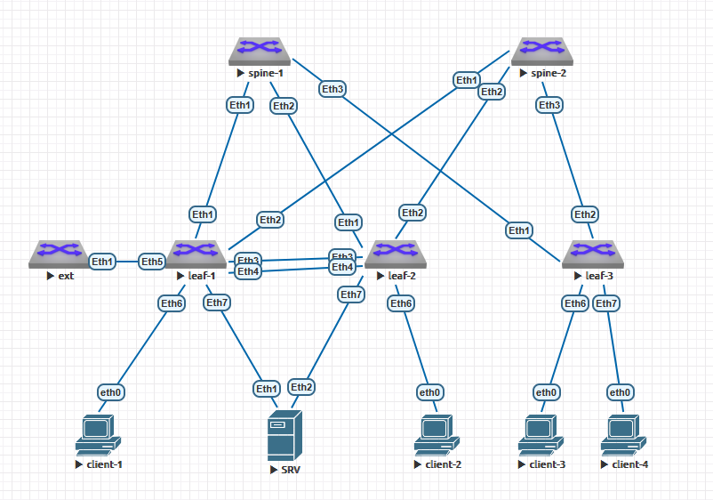

#  Проектная работа
## Проектирование сетевой фабрики на основе VxLAN EVPN
### Цель: Создание масштабируемой, отказоустойчивой и гибкой сети в рамках ЦОД

Проект посвящен разработке эффективной архитектуры сетевой фабрики для центров обработки данных (ЦОД) с использованием технологии виртуализации сетей VxLAN (Virtual Extensible LAN) совместно с механизмом EVPN (Ethernet Virtual Private Network). Выбор данной комбинации обусловлен необходимостью обеспечить масштабируемость, высокую производительность и гибкость современных корпоративных инфраструктур.
Обоснование выбора:
+ **Масштабируемость**: Технология VxLAN позволяет строить плоские L2-домены практически неограниченного масштаба благодаря использованию 24-разрядных идентификаторов сегментов (VNI), поддерживая тысячи виртуальных локальных сетей одновременно.
+ **Эффективность управления трафиком**: Механизм EVPN предоставляет улучшенные средства контроля над многоадресной передачей и автоматизацию распределения MAC/IP-адресов среди коммутаторов, сокращая нагрузку на управляющие плоскости и уменьшая время распространения изменений конфигурации.    Повышение отказоустойчивости: Благодаря использованию MPLS-подобных методов коммутации и динамического перенаправления потоков достигается высокая степень устойчивости к сбоям и быстрым изменениям топологии сети.

Особенности организации сетей ЦОД:
+ проект учитывает особенности современного ЦОД, такие как необходимость поддержки множества виртуализированных сервисов, высокая плотность подключенных узлов и требовательность приложений к минимизации задержек и потере пакетов;
+ предусматривается применение многозональных подходов и схем резервирования ключевых элементов сети, обеспечение качества обслуживания (QoS) для критически важных бизнес-процессов;
+ особое внимание уделено вопросам безопасности и изоляции трафика различных клиентов и отделов внутри единой физической инфраструктуры.

Данный проект нацелен на создание высокопроизводительной, легко управляемой и надежной платформы для удовлетворения потребностей предприятий различного уровня сложности и объемов нагрузки.

## Практическая часть
#### Схема ЦОД
1. Схема сети



2. Адресное пространство для Underlay
+ Lo1 - 172.16.XNN.0/16, где X нечётный - spine, X чётный - leaf; N - номер коммутатора 
+ Lo2 - 172.17.XNN.0/16, где X нечётный - spine, X чётный - leaf; N - номер коммутатора
+ P2P links - 172.18.NNN.0/15, где N - номер коммутатора spine

Таблица адресов
  
| Hostname | Interface |  	IP/MASK    |	Description |
|----------|-----------|---------------|--------------|
|spine-1   |Eth1     |172.18.1.0/31  |-L- leaf-1    |
|spine-1   |Eth2     |172.18.1.2/31  |-L- leaf-2    |
|spine-1   |Eth3     |172.18.1.4/31  |-L- leaf-3    |
|spine-1   |L01        |172.16.101.1/32  |           |
|spine-1   |L02        |172.17.101.1/32|             |
|spine-2   |Eth1     |172.18.2.0/31  |-L- leaf-1    |
|spine-2   |Eth2     |172.18.2.2/31  |-L- leaf-2    |
|spine-2   |Eth3     |172.18.2.4/31  |-L- leaf-3    |
|spine-2   |L01        |172.16.102.1/32  |            |
|spine-2   |L02        |172.17.102.1/32|              |
|leaf-1    |Eth1     |172.18.1.1/31  |-S- spine-1    |
|leaf-1    |Eth2     |172.18.2.1/31  |-S- spine-2    |
|leaf-1    |L01        |172.16.201.1/32 |              |
|leaf-1    |L02        |172.17.201.1/32|              |
|leaf-1    |Vlan10   |192.168.10.254/24|              |
|leaf-1    |Vlan11   |192.168.11.254/24|              |
|leaf-1    |Vlan100   |100.100.100.100/24|              |
|leaf-1    |Vlan101  |101.101.101.101/24|              |
|leaf-2    |Eth1     |172.18.1.3/31  |-S- spine-1    |
|leaf-2    |Eth2     |172.18.2.3/31  |-S- spine-2    |
|leaf-2    |L01        |172.16.202.1/32 |              |
|leaf-2    |L02        |172.17.202.1/32|              |
|leaf-3    |Eth1     |172.18.1.5/31  |-S- spine-1    |
|leaf-3    |Eth2     |172.18.2.5/31  |-S- spine-2    |
|leaf-3    |L01        |172.16.203.1/32 |              |
|leaf-3    |L02        |172.17.203.1/32|              |
|srv    |Vlan10        |192.168.10.10/24|              |
|srv    |Vlan11        |192.168.11.11/24|              |
|ext    |Vlan100        |100.100.100.99/24|            |
|ext    |Vlan101        |101.101.101.100/24|           |
|ext    |Loopback1      |5.5.5.5/32|           |
|client-1   |Eth        |192.168.10.1/24|              |
|client-2   |Eth        |101.101.101.1/24|              |
|client-3   |Eth        |192.168.10.2/24|              |
|client-4   |Eth        |101.101.11.1/24|              |


Для коммутаторов spine выбрана AS 65000, для коммутаторов leaf - соответственно по их номерам 65001, 65002, 65003.

3. Настройки оборудования приведены в соотвествующих текстовых файлах в этом каталоге, настройки клиентов приведены ниже:

**client-1**

```
client-1> show ip

NAME        : client-1[1]
IP/MASK     : 192.168.10.1/24
GATEWAY     : 192.168.10.254
DNS         :
MAC         : 00:50:79:66:68:06
LPORT       : 20000
RHOST:PORT  : 127.0.0.1:30000
MTU         : 1500
```

**client-2**

```
client-2> show ip

NAME        : client-2[1]
IP/MASK     : 101.101.101.1/24
GATEWAY     : 101.101.101.101
DNS         :
MAC         : 00:50:79:66:68:09
LPORT       : 20000
RHOST:PORT  : 127.0.0.1:30000
MTU         : 1500
```

**client-3**

```
client-3> show ip

NAME        : client-3[1]
IP/MASK     : 192.168.10.2/24
GATEWAY     : 192.168.10.254
DNS         :
MAC         : 00:50:79:66:68:08
LPORT       : 20000
RHOST:PORT  : 127.0.0.1:30000
MTU         : 1500
```

**client-4**

```
client-4> show ip

NAME        : client-4[1]
IP/MASK     : 192.168.11.1/24
GATEWAY     : 192.168.11.254
DNS         :
MAC         : 00:50:79:66:68:07
LPORT       : 20000
RHOST:PORT  : 127.0.0.1:30000
MTU         : 1500
```

4. Таблицы маршрутизации на коммутаторах:

**Коммутатор spine-1**

```
spine-1#show ip route

VRF: default
Codes: C - connected, S - static, K - kernel,
       O - OSPF, IA - OSPF inter area, E1 - OSPF external type 1,
       E2 - OSPF external type 2, N1 - OSPF NSSA external type 1,
       N2 - OSPF NSSA external type2, B - Other BGP Routes,
       B I - iBGP, B E - eBGP, R - RIP, I L1 - IS-IS level 1,
       I L2 - IS-IS level 2, O3 - OSPFv3, A B - BGP Aggregate,
       A O - OSPF Summary, NG - Nexthop Group Static Route,
       V - VXLAN Control Service, M - Martian,
       DH - DHCP client installed default route,
       DP - Dynamic Policy Route, L - VRF Leaked,
       G  - gRIBI, RC - Route Cache Route

Gateway of last resort is not set

 C        172.16.101.1/32 is directly connected, Loopback1
 B E      172.16.201.1/32 [200/0] via 172.18.1.1, Ethernet1
 B E      172.16.202.1/32 [200/0] via 172.18.1.3, Ethernet2
 B E      172.16.203.1/32 [200/0] via 172.18.1.5, Ethernet3
 C        172.17.101.1/32 is directly connected, Loopback2
 B E      172.17.201.1/32 [200/0] via 172.18.1.1, Ethernet1
 B E      172.17.202.1/32 [200/0] via 172.18.1.3, Ethernet2
 B E      172.17.203.1/32 [200/0] via 172.18.1.5, Ethernet3
 C        172.18.1.0/31 is directly connected, Ethernet1
 C        172.18.1.2/31 is directly connected, Ethernet2
 C        172.18.1.4/31 is directly connected, Ethernet3
```

**Коммутатор spine-2**

```
spine-2#show ip route vrf all

VRF: default
Codes: C - connected, S - static, K - kernel,
       O - OSPF, IA - OSPF inter area, E1 - OSPF external type 1,
       E2 - OSPF external type 2, N1 - OSPF NSSA external type 1,
       N2 - OSPF NSSA external type2, B - Other BGP Routes,
       B I - iBGP, B E - eBGP, R - RIP, I L1 - IS-IS level 1,
       I L2 - IS-IS level 2, O3 - OSPFv3, A B - BGP Aggregate,
       A O - OSPF Summary, NG - Nexthop Group Static Route,
       V - VXLAN Control Service, M - Martian,
       DH - DHCP client installed default route,
       DP - Dynamic Policy Route, L - VRF Leaked,
       G  - gRIBI, RC - Route Cache Route

Gateway of last resort is not set

 C        172.16.102.1/32 is directly connected, Loopback1
 B E      172.16.201.1/32 [200/0] via 172.18.2.1, Ethernet1
 B E      172.16.202.1/32 [200/0] via 172.18.2.3, Ethernet2
 B E      172.16.203.1/32 [200/0] via 172.18.2.5, Ethernet3
 C        172.17.102.1/32 is directly connected, Loopback2
 B E      172.17.201.1/32 [200/0] via 172.18.2.1, Ethernet1
 B E      172.17.202.1/32 [200/0] via 172.18.2.3, Ethernet2
 B E      172.17.203.1/32 [200/0] via 172.18.2.5, Ethernet3
 C        172.18.2.0/31 is directly connected, Ethernet1
 C        172.18.2.2/31 is directly connected, Ethernet2
 C        172.18.2.4/31 is directly connected, Ethernet3
```

**Коммутатор ext**

```
ext#show ip route vrf all

VRF: default
Codes: C - connected, S - static, K - kernel,
       O - OSPF, IA - OSPF inter area, E1 - OSPF external type 1,
       E2 - OSPF external type 2, N1 - OSPF NSSA external type 1,
       N2 - OSPF NSSA external type2, B - Other BGP Routes,
       B I - iBGP, B E - eBGP, R - RIP, I L1 - IS-IS level 1,
       I L2 - IS-IS level 2, O3 - OSPFv3, A B - BGP Aggregate,
       A O - OSPF Summary, NG - Nexthop Group Static Route,
       V - VXLAN Control Service, M - Martian,
       DH - DHCP client installed default route,
       DP - Dynamic Policy Route, L - VRF Leaked,
       G  - gRIBI, RC - Route Cache Route

Gateway of last resort:
 S        0.0.0.0/0 is directly connected, Null0

 C        5.5.5.5/32 is directly connected, Loopback1
 C        100.100.100.0/24 is directly connected, Vlan100
 C        101.101.101.0/24 is directly connected, Vlan101
 B E      192.168.10.0/24 [200/0] via 100.100.100.100, Vlan100
 B E      192.168.11.0/24 [200/0] via 100.100.100.100, Vlan100
```

**Коммутатор leaf-1**

```
leaf-1#show ip route vrf all

VRF: default
Codes: C - connected, S - static, K - kernel,
       O - OSPF, IA - OSPF inter area, E1 - OSPF external type 1,
       E2 - OSPF external type 2, N1 - OSPF NSSA external type 1,
       N2 - OSPF NSSA external type2, B - Other BGP Routes,
       B I - iBGP, B E - eBGP, R - RIP, I L1 - IS-IS level 1,
       I L2 - IS-IS level 2, O3 - OSPFv3, A B - BGP Aggregate,
       A O - OSPF Summary, NG - Nexthop Group Static Route,
       V - VXLAN Control Service, M - Martian,
       DH - DHCP client installed default route,
       DP - Dynamic Policy Route, L - VRF Leaked,
       G  - gRIBI, RC - Route Cache Route

Gateway of last resort is not set

 C        10.50.50.0/31 is directly connected, Vlan50
 B E      172.16.101.1/32 [200/0] via 172.18.1.0, Ethernet1
 B E      172.16.102.1/32 [200/0] via 172.18.2.0, Ethernet2
 C        172.16.201.1/32 is directly connected, Loopback1
 B E      172.16.202.1/32 [200/0] via 172.18.1.0, Ethernet1
                                  via 172.18.2.0, Ethernet2
 B E      172.16.203.1/32 [200/0] via 172.18.1.0, Ethernet1
                                  via 172.18.2.0, Ethernet2
 B E      172.17.101.1/32 [200/0] via 172.18.1.0, Ethernet1
 B E      172.17.102.1/32 [200/0] via 172.18.2.0, Ethernet2
 C        172.17.201.1/32 is directly connected, Loopback2
 B E      172.17.202.1/32 [200/0] via 172.18.1.0, Ethernet1
                                  via 172.18.2.0, Ethernet2
 B E      172.17.203.1/32 [200/0] via 172.18.1.0, Ethernet1
                                  via 172.18.2.0, Ethernet2
 C        172.18.1.0/31 is directly connected, Ethernet1
 C        172.18.2.0/31 is directly connected, Ethernet2


VRF: OTUS
Codes: C - connected, S - static, K - kernel,
       O - OSPF, IA - OSPF inter area, E1 - OSPF external type 1,
       E2 - OSPF external type 2, N1 - OSPF NSSA external type 1,
       N2 - OSPF NSSA external type2, B - Other BGP Routes,
       B I - iBGP, B E - eBGP, R - RIP, I L1 - IS-IS level 1,
       I L2 - IS-IS level 2, O3 - OSPFv3, A B - BGP Aggregate,
       A O - OSPF Summary, NG - Nexthop Group Static Route,
       V - VXLAN Control Service, M - Martian,
       DH - DHCP client installed default route,
       DP - Dynamic Policy Route, L - VRF Leaked,
       G  - gRIBI, RC - Route Cache Route

Gateway of last resort:
 B E      0.0.0.0/0 [200/0] via 100.100.100.99, Vlan100

 B E      5.5.5.5/32 [200/0] via 100.100.100.99, Vlan100
 C        100.100.100.0/24 is directly connected, Vlan100
 B E      101.101.101.0/24 [200/0] via 100.100.100.99, Vlan100
 C        192.168.10.0/24 is directly connected, Vlan10
 C        192.168.11.0/24 is directly connected, Vlan11


VRF: OTUS2
Codes: C - connected, S - static, K - kernel,
       O - OSPF, IA - OSPF inter area, E1 - OSPF external type 1,
       E2 - OSPF external type 2, N1 - OSPF NSSA external type 1,
       N2 - OSPF NSSA external type2, B - Other BGP Routes,
       B I - iBGP, B E - eBGP, R - RIP, I L1 - IS-IS level 1,
       I L2 - IS-IS level 2, O3 - OSPFv3, A B - BGP Aggregate,
       A O - OSPF Summary, NG - Nexthop Group Static Route,
       V - VXLAN Control Service, M - Martian,
       DH - DHCP client installed default route,
       DP - Dynamic Policy Route, L - VRF Leaked,
       G  - gRIBI, RC - Route Cache Route

Gateway of last resort:
 B E      0.0.0.0/0 [200/0] via 101.101.101.100, Vlan101

 B E      5.5.5.5/32 [200/0] via 101.101.101.100, Vlan101
 B E      100.100.100.0/24 [200/0] via 101.101.101.100, Vlan101
 C        101.101.101.0/24 is directly connected, Vlan101
leaf-1
```

**Коммутатор leaf-2**

```
leaf-2#show ip route vrf all

VRF: default
Codes: C - connected, S - static, K - kernel,
       O - OSPF, IA - OSPF inter area, E1 - OSPF external type 1,
       E2 - OSPF external type 2, N1 - OSPF NSSA external type 1,
       N2 - OSPF NSSA external type2, B - Other BGP Routes,
       B I - iBGP, B E - eBGP, R - RIP, I L1 - IS-IS level 1,
       I L2 - IS-IS level 2, O3 - OSPFv3, A B - BGP Aggregate,
       A O - OSPF Summary, NG - Nexthop Group Static Route,
       V - VXLAN Control Service, M - Martian,
       DH - DHCP client installed default route,
       DP - Dynamic Policy Route, L - VRF Leaked,
       G  - gRIBI, RC - Route Cache Route

Gateway of last resort is not set

 C        10.50.50.0/31 is directly connected, Vlan50
 B E      172.16.101.1/32 [200/0] via 172.18.1.2, Ethernet1
 B E      172.16.102.1/32 [200/0] via 172.18.2.2, Ethernet2
 B E      172.16.201.1/32 [200/0] via 172.18.1.2, Ethernet1
                                  via 172.18.2.2, Ethernet2
 C        172.16.202.1/32 is directly connected, Loopback1
 B E      172.16.203.1/32 [200/0] via 172.18.1.2, Ethernet1
                                  via 172.18.2.2, Ethernet2
 B E      172.17.101.1/32 [200/0] via 172.18.1.2, Ethernet1
 B E      172.17.102.1/32 [200/0] via 172.18.2.2, Ethernet2
 B E      172.17.201.1/32 [200/0] via 172.18.1.2, Ethernet1
                                  via 172.18.2.2, Ethernet2
 C        172.17.202.1/32 is directly connected, Loopback2
 B E      172.17.203.1/32 [200/0] via 172.18.1.2, Ethernet1
                                  via 172.18.2.2, Ethernet2
 C        172.18.1.2/31 is directly connected, Ethernet1
 C        172.18.2.2/31 is directly connected, Ethernet2


VRF: OTUS
Codes: C - connected, S - static, K - kernel,
       O - OSPF, IA - OSPF inter area, E1 - OSPF external type 1,
       E2 - OSPF external type 2, N1 - OSPF NSSA external type 1,
       N2 - OSPF NSSA external type2, B - Other BGP Routes,
       B I - iBGP, B E - eBGP, R - RIP, I L1 - IS-IS level 1,
       I L2 - IS-IS level 2, O3 - OSPFv3, A B - BGP Aggregate,
       A O - OSPF Summary, NG - Nexthop Group Static Route,
       V - VXLAN Control Service, M - Martian,
       DH - DHCP client installed default route,
       DP - Dynamic Policy Route, L - VRF Leaked,
       G  - gRIBI, RC - Route Cache Route

Gateway of last resort:
 B E      0.0.0.0/0 [200/0] via VTEP 172.17.201.1 VNI 20000 router-mac 50:00:00:d5:5d:c0 local-interface Vxlan1

 B E      5.5.5.5/32 [200/0] via VTEP 172.17.201.1 VNI 20000 router-mac 50:00:00:d5:5d:c0 local-interface Vxlan1
 B E      100.100.100.0/24 [200/0] via VTEP 172.17.201.1 VNI 20000 router-mac 50:00:00:d5:5d:c0 local-interface Vxlan1
 B E      101.101.101.0/24 [200/0] via VTEP 172.17.201.1 VNI 20000 router-mac 50:00:00:d5:5d:c0 local-interface Vxlan1
 B E      192.168.10.1/32 [200/0] via VTEP 172.17.201.1 VNI 20000 router-mac 50:00:00:d5:5d:c0 local-interface Vxlan1
 B E      192.168.10.10/32 [200/0] via VTEP 172.17.201.1 VNI 20000 router-mac 50:00:00:d5:5d:c0 local-interface Vxlan1
 B E      192.168.10.0/24 [200/0] via VTEP 172.17.201.1 VNI 20000 router-mac 50:00:00:d5:5d:c0 local-interface Vxlan1
 B E      192.168.11.11/32 [200/0] via VTEP 172.17.201.1 VNI 20000 router-mac 50:00:00:d5:5d:c0 local-interface Vxlan1
 B E      192.168.11.0/24 [200/0] via VTEP 172.17.201.1 VNI 20000 router-mac 50:00:00:d5:5d:c0 local-interface Vxlan1

leaf-2#
```

**Коммутатор leaf-3**

```
leaf-3#show ip route vrf all

VRF: default
Codes: C - connected, S - static, K - kernel,
       O - OSPF, IA - OSPF inter area, E1 - OSPF external type 1,
       E2 - OSPF external type 2, N1 - OSPF NSSA external type 1,
       N2 - OSPF NSSA external type2, B - Other BGP Routes,
       B I - iBGP, B E - eBGP, R - RIP, I L1 - IS-IS level 1,
       I L2 - IS-IS level 2, O3 - OSPFv3, A B - BGP Aggregate,
       A O - OSPF Summary, NG - Nexthop Group Static Route,
       V - VXLAN Control Service, M - Martian,
       DH - DHCP client installed default route,
       DP - Dynamic Policy Route, L - VRF Leaked,
       G  - gRIBI, RC - Route Cache Route

Gateway of last resort is not set

 B E      172.16.101.1/32 [200/0] via 172.18.1.4, Ethernet1
 B E      172.16.102.1/32 [200/0] via 172.18.2.4, Ethernet2
 B E      172.16.201.1/32 [200/0] via 172.18.1.4, Ethernet1
                                  via 172.18.2.4, Ethernet2
 B E      172.16.202.1/32 [200/0] via 172.18.1.4, Ethernet1
                                  via 172.18.2.4, Ethernet2
 C        172.16.203.1/32 is directly connected, Loopback1
 B E      172.17.101.1/32 [200/0] via 172.18.1.4, Ethernet1
 B E      172.17.102.1/32 [200/0] via 172.18.2.4, Ethernet2
 B E      172.17.201.1/32 [200/0] via 172.18.1.4, Ethernet1
                                  via 172.18.2.4, Ethernet2
 B E      172.17.202.1/32 [200/0] via 172.18.1.4, Ethernet1
                                  via 172.18.2.4, Ethernet2
 C        172.17.203.1/32 is directly connected, Loopback2
 C        172.18.1.4/31 is directly connected, Ethernet1
 C        172.18.2.4/31 is directly connected, Ethernet2

leaf-3#
```

5. Проверка дополнительных настроек BGP и EVPN, наличия маршрутов, MLAG'ов

**Коммутатор spine-1**

```
spine-1#show ip bgp summary
BGP summary information for VRF default
Router identifier 172.16.101.1, local AS number 65000
Neighbor Status Codes: m - Under maintenance
  Neighbor     V AS           MsgRcvd   MsgSent  InQ OutQ  Up/Down State   PfxRcd PfxAcc
  172.16.201.1 4 65001           1530      1501    0    0 01:01:54 Estab   2      2
  172.16.202.1 4 65002           2393      2356    0    0 01:35:16 Estab   2      2
  172.16.203.1 4 65003           2396      2389    0    0 01:35:15 Estab   2      2
  172.18.1.1   4 65001           1478      1463    0    0 01:02:00 Estab   4      2
  172.18.1.3   4 65002           1458      1459    0    0 01:01:58 Estab   6      2
  172.18.1.5   4 65003           1456      1461    0    0 01:01:57 Estab   4      2

spine-1#show bgp evpn
BGP routing table information for VRF default
Router identifier 172.16.101.1, local AS number 65000
Route status codes: * - valid, > - active, S - Stale, E - ECMP head, e - ECMP
                    c - Contributing to ECMP, % - Pending BGP convergence
Origin codes: i - IGP, e - EGP, ? - incomplete
AS Path Attributes: Or-ID - Originator ID, C-LST - Cluster List, LL Nexthop - Link Local Nexthop

          Network                Next Hop              Metric  LocPref Weight  Path
 * >      RD: 65001:10010 mac-ip 0000.0000.0001
                                 172.16.201.1          -       100     0       65001 i
 * >      RD: 65001:10011 mac-ip 0000.0000.0001
                                 172.16.201.1          -       100     0       65001 i
 * >      RD: 65001:10101 mac-ip 0000.0000.0001
                                 172.16.201.1          -       100     0       65001 i
 * >      RD: 65002:10010 mac-ip 0000.0000.0002
                                 172.16.202.1          -       100     0       65002 i
 * >      RD: 65002:10011 mac-ip 0000.0000.0002
                                 172.16.202.1          -       100     0       65002 i
 * >      RD: 65002:10101 mac-ip 0000.0000.0002
                                 172.16.202.1          -       100     0       65002 i
 * >      RD: 65003:10010 mac-ip 0000.0000.0002
                                 172.16.203.1          -       100     0       65003 i
 * >      RD: 65003:10011 mac-ip 0000.0000.0002
                                 172.16.203.1          -       100     0       65003 i
 * >      RD: 65001:10010 mac-ip 0050.7966.6806
                                 172.17.201.1          -       100     0       65001 i
 * >      RD: 65002:10010 mac-ip 0050.7966.6806
                                 172.17.202.1          -       100     0       65002 i
 * >      RD: 65001:10010 mac-ip 0050.7966.6806 192.168.10.1
                                 172.17.201.1          -       100     0       65001 i
 * >      RD: 65003:10011 mac-ip 0050.7966.6807
                                 172.17.203.1          -       100     0       65003 i
 * >      RD: 65003:10010 mac-ip 0050.7966.6808
                                 172.17.203.1          -       100     0       65003 i
 * >      RD: 65001:10101 mac-ip 0050.7966.6809
                                 172.17.201.1          -       100     0       65001 i
 * >      RD: 65002:10101 mac-ip 0050.7966.6809
                                 172.17.202.1          -       100     0       65002 i
 * >      RD: 65001:10101 mac-ip 0050.7966.6809 101.101.101.1
                                 172.17.201.1          -       100     0       65001 i
 * >      RD: 65001:10101 mac-ip 5000.00ae.f703
                                 172.17.201.1          -       100     0       65001 i
 * >      RD: 65002:10101 mac-ip 5000.00ae.f703
                                 172.17.202.1          -       100     0       65002 i
 * >      RD: 65001:10101 mac-ip 5000.00ae.f703 101.101.101.100
                                 172.17.201.1          -       100     0       65001 i
 * >      RD: 65001:10010 mac-ip 5000.00af.d3f6
                                 172.17.201.1          -       100     0       65001 i
 * >      RD: 65001:10011 mac-ip 5000.00af.d3f6
                                 172.17.201.1          -       100     0       65001 i
 * >      RD: 65002:10010 mac-ip 5000.00af.d3f6
                                 172.17.202.1          -       100     0       65002 i
 * >      RD: 65002:10011 mac-ip 5000.00af.d3f6
                                 172.17.202.1          -       100     0       65002 i
 * >      RD: 65001:10010 mac-ip 5000.00af.d3f6 192.168.10.10
                                 172.17.201.1          -       100     0       65001 i
 * >      RD: 65001:10011 mac-ip 5000.00af.d3f6 192.168.11.11
                                 172.17.201.1          -       100     0       65001 i
 * >      RD: 65001:10010 imet 172.16.201.1
                                 172.17.201.1          -       100     0       65001 i
 * >      RD: 65001:10011 imet 172.16.201.1
                                 172.17.201.1          -       100     0       65001 i
 * >      RD: 65001:10101 imet 172.16.201.1
                                 172.17.201.1          -       100     0       65001 i
 * >      RD: 65002:10010 imet 172.16.202.1
                                 172.17.202.1          -       100     0       65002 i
 * >      RD: 65002:10011 imet 172.16.202.1
                                 172.17.202.1          -       100     0       65002 i
 * >      RD: 65002:10101 imet 172.16.202.1
                                 172.17.202.1          -       100     0       65002 i
 * >      RD: 65003:10010 imet 172.16.203.1
                                 172.17.203.1          -       100     0       65003 i
 * >      RD: 65003:10011 imet 172.16.203.1
                                 172.17.203.1          -       100     0       65003 i
 * >      RD: 65001:10010 imet 172.17.201.1
                                 172.17.201.1          -       100     0       65001 i
 * >      RD: 65001:10011 imet 172.17.201.1
                                 172.17.201.1          -       100     0       65001 i
 * >      RD: 65001:10101 imet 172.17.201.1
                                 172.17.201.1          -       100     0       65001 i
 * >      RD: 65002:10010 imet 172.17.202.1
                                 172.17.202.1          -       100     0       65002 i
 * >      RD: 65002:10011 imet 172.17.202.1
                                 172.17.202.1          -       100     0       65002 i
 * >      RD: 65002:10101 imet 172.17.202.1
                                 172.17.202.1          -       100     0       65002 i
 * >      RD: 65003:10010 imet 172.17.203.1
                                 172.17.203.1          -       100     0       65003 i
 * >      RD: 65003:10011 imet 172.17.203.1
                                 172.17.203.1          -       100     0       65003 i
 * >      RD: 65001:101 ip-prefix 0.0.0.0/0
                                 172.17.201.1          -       100     0       65001 65050 ?
 * >      RD: 65001:20000 ip-prefix 0.0.0.0/0
                                 172.17.201.1          -       100     0       65001 65050 ?
 * >      RD: 65001:101 ip-prefix 5.5.5.5/32
                                 172.17.201.1          -       100     0       65001 65050 i
 * >      RD: 65001:20000 ip-prefix 5.5.5.5/32
                                 172.17.201.1          -       100     0       65001 65050 i
 * >      RD: 65001:101 ip-prefix 100.100.100.0/24
                                 172.17.201.1          -       100     0       65001 65050 i
 * >      RD: 65001:20000 ip-prefix 100.100.100.0/24
                                 172.17.201.1          -       100     0       65001 i
 * >      RD: 65001:101 ip-prefix 101.101.101.0/24
                                 172.17.201.1          -       100     0       65001 i
 * >      RD: 65001:20000 ip-prefix 101.101.101.0/24
                                 172.17.201.1          -       100     0       65001 65050 i
 * >      RD: 65001:20000 ip-prefix 192.168.10.0/24
                                 172.17.201.1          -       100     0       65001 i
 * >      RD: 65001:20000 ip-prefix 192.168.11.0/24
                                 172.17.201.1          -       100     0       65001 i
spine-1#
```

**Коммутатор spine-2**

```
spine-2#show ip bgp summary
BGP summary information for VRF default
Router identifier 172.16.102.1, local AS number 65000
Neighbor Status Codes: m - Under maintenance
  Neighbor     V AS           MsgRcvd   MsgSent  InQ OutQ  Up/Down State   PfxRcd PfxAcc
  172.16.201.1 4 65001           2375      2331    0    0 01:35:19 Estab   2      2
  172.16.202.1 4 65002           2332      2365    0    0 01:35:25 Estab   2      2
  172.16.203.1 4 65003           2336      2408    0    0 01:35:24 Estab   2      2
  172.18.2.1   4 65001           1457      1473    0    0 01:02:02 Estab   8      2
  172.18.2.3   4 65002           1466      1466    0    0 01:02:05 Estab   6      2
  172.18.2.5   4 65003           1463      1467    0    0 01:02:06 Estab   8      2

spine-2#show bgp evpn
BGP routing table information for VRF default
Router identifier 172.16.102.1, local AS number 65000
Route status codes: * - valid, > - active, S - Stale, E - ECMP head, e - ECMP
                    c - Contributing to ECMP, % - Pending BGP convergence
Origin codes: i - IGP, e - EGP, ? - incomplete
AS Path Attributes: Or-ID - Originator ID, C-LST - Cluster List, LL Nexthop - Link Local Nexthop

          Network                Next Hop              Metric  LocPref Weight  Path
 * >      RD: 65001:10010 mac-ip 0000.0000.0001
                                 172.16.201.1          -       100     0       65001 i
 * >      RD: 65001:10011 mac-ip 0000.0000.0001
                                 172.16.201.1          -       100     0       65001 i
 * >      RD: 65001:10101 mac-ip 0000.0000.0001
                                 172.16.201.1          -       100     0       65001 i
 * >      RD: 65002:10010 mac-ip 0000.0000.0002
                                 172.16.202.1          -       100     0       65002 i
 * >      RD: 65002:10011 mac-ip 0000.0000.0002
                                 172.16.202.1          -       100     0       65002 i
 * >      RD: 65002:10101 mac-ip 0000.0000.0002
                                 172.16.202.1          -       100     0       65002 i
 * >      RD: 65003:10010 mac-ip 0000.0000.0002
                                 172.16.203.1          -       100     0       65003 i
 * >      RD: 65003:10011 mac-ip 0000.0000.0002
                                 172.16.203.1          -       100     0       65003 i
 * >      RD: 65001:10010 mac-ip 0050.7966.6806
                                 172.17.201.1          -       100     0       65001 i
 * >      RD: 65002:10010 mac-ip 0050.7966.6806
                                 172.17.202.1          -       100     0       65002 i
 * >      RD: 65001:10010 mac-ip 0050.7966.6806 192.168.10.1
                                 172.17.201.1          -       100     0       65001 i
 * >      RD: 65003:10011 mac-ip 0050.7966.6807
                                 172.17.203.1          -       100     0       65003 i
 * >      RD: 65003:10010 mac-ip 0050.7966.6808
                                 172.17.203.1          -       100     0       65003 i
 * >      RD: 65001:10101 mac-ip 0050.7966.6809
                                 172.17.201.1          -       100     0       65001 i
 * >      RD: 65002:10101 mac-ip 0050.7966.6809
                                 172.17.202.1          -       100     0       65002 i
 * >      RD: 65001:10101 mac-ip 0050.7966.6809 101.101.101.1
                                 172.17.201.1          -       100     0       65001 i
 * >      RD: 65001:10101 mac-ip 5000.00ae.f703
                                 172.17.201.1          -       100     0       65001 i
 * >      RD: 65002:10101 mac-ip 5000.00ae.f703
                                 172.17.202.1          -       100     0       65002 i
 * >      RD: 65001:10101 mac-ip 5000.00ae.f703 101.101.101.100
                                 172.17.201.1          -       100     0       65001 i
 * >      RD: 65001:10010 mac-ip 5000.00af.d3f6
                                 172.17.201.1          -       100     0       65001 i
 * >      RD: 65001:10011 mac-ip 5000.00af.d3f6
                                 172.17.201.1          -       100     0       65001 i
 * >      RD: 65002:10010 mac-ip 5000.00af.d3f6
                                 172.17.202.1          -       100     0       65002 i
 * >      RD: 65002:10011 mac-ip 5000.00af.d3f6
                                 172.17.202.1          -       100     0       65002 i
 * >      RD: 65001:10010 mac-ip 5000.00af.d3f6 192.168.10.10
                                 172.17.201.1          -       100     0       65001 i
 * >      RD: 65001:10011 mac-ip 5000.00af.d3f6 192.168.11.11
                                 172.17.201.1          -       100     0       65001 i
 * >      RD: 65001:10010 imet 172.16.201.1
                                 172.17.201.1          -       100     0       65001 i
 * >      RD: 65001:10011 imet 172.16.201.1
                                 172.17.201.1          -       100     0       65001 i
 * >      RD: 65001:10101 imet 172.16.201.1
                                 172.17.201.1          -       100     0       65001 i
 * >      RD: 65002:10010 imet 172.16.202.1
                                 172.17.202.1          -       100     0       65002 i
 * >      RD: 65002:10011 imet 172.16.202.1
                                 172.17.202.1          -       100     0       65002 i
 * >      RD: 65002:10101 imet 172.16.202.1
                                 172.17.202.1          -       100     0       65002 i
 * >      RD: 65003:10010 imet 172.16.203.1
                                 172.17.203.1          -       100     0       65003 i
 * >      RD: 65003:10011 imet 172.16.203.1
                                 172.17.203.1          -       100     0       65003 i
 * >      RD: 65001:10010 imet 172.17.201.1
                                 172.17.201.1          -       100     0       65001 i
 * >      RD: 65001:10011 imet 172.17.201.1
                                 172.17.201.1          -       100     0       65001 i
 * >      RD: 65001:10101 imet 172.17.201.1
                                 172.17.201.1          -       100     0       65001 i
 * >      RD: 65002:10010 imet 172.17.202.1
                                 172.17.202.1          -       100     0       65002 i
 * >      RD: 65002:10011 imet 172.17.202.1
                                 172.17.202.1          -       100     0       65002 i
 * >      RD: 65002:10101 imet 172.17.202.1
                                 172.17.202.1          -       100     0       65002 i
 * >      RD: 65003:10010 imet 172.17.203.1
                                 172.17.203.1          -       100     0       65003 i
 * >      RD: 65003:10011 imet 172.17.203.1
                                 172.17.203.1          -       100     0       65003 i
 * >      RD: 65001:101 ip-prefix 0.0.0.0/0
                                 172.17.201.1          -       100     0       65001 65050 ?
 * >      RD: 65001:20000 ip-prefix 0.0.0.0/0
                                 172.17.201.1          -       100     0       65001 65050 ?
 * >      RD: 65001:101 ip-prefix 5.5.5.5/32
                                 172.17.201.1          -       100     0       65001 65050 i
 * >      RD: 65001:20000 ip-prefix 5.5.5.5/32
                                 172.17.201.1          -       100     0       65001 65050 i
 * >      RD: 65001:101 ip-prefix 100.100.100.0/24
                                 172.17.201.1          -       100     0       65001 65050 i
 * >      RD: 65001:20000 ip-prefix 100.100.100.0/24
                                 172.17.201.1          -       100     0       65001 i
 * >      RD: 65001:101 ip-prefix 101.101.101.0/24
                                 172.17.201.1          -       100     0       65001 i
 * >      RD: 65001:20000 ip-prefix 101.101.101.0/24
                                 172.17.201.1          -       100     0       65001 65050 i
 * >      RD: 65001:20000 ip-prefix 192.168.10.0/24
                                 172.17.201.1          -       100     0       65001 i
 * >      RD: 65001:20000 ip-prefix 192.168.11.0/24
                                 172.17.201.1          -       100     0       65001 i
spine-2#
```

**Коммутатор ext**

```
ext#show ip bgp summary
BGP summary information for VRF default
Router identifier 5.5.5.5, local AS number 65050
Neighbor Status Codes: m - Under maintenance
  Neighbor         V  AS           MsgRcvd   MsgSent  InQ OutQ  Up/Down State   PfxRcd PfxAcc
  100.100.100.100  4  65001           4078      3476    0    0 01:02:08 Estab   3      3
  101.101.101.101  4  65001           4395      3767    0    0 01:02:09 Estab   1      1
ext#
```
**Коммутатор leaf-1**

```
leaf-1#
leaf-1#show ip bgp summary
BGP summary information for VRF default
Router identifier 172.16.201.1, local AS number 65001
Neighbor Status Codes: m - Under maintenance
  Neighbor     V AS           MsgRcvd   MsgSent  InQ OutQ  Up/Down State   PfxRcd PfxAcc
  172.16.101.1 4 65000           2327      2408    0    0 01:02:18 Estab   6      6
  172.16.102.1 4 65000           2337      2381    0    0 01:35:35 Estab   6      6
  172.18.1.0   4 65000           2260      2271    0    0 01:02:25 Estab   6      6
  172.18.2.0   4 65000           2268      2251    0    0 01:02:18 Estab   6      6

leaf-1#
leaf-1#show bgp evpn
BGP routing table information for VRF default
Router identifier 172.16.201.1, local AS number 65001
Route status codes: * - valid, > - active, S - Stale, E - ECMP head, e - ECMP
                    c - Contributing to ECMP, % - Pending BGP convergence
Origin codes: i - IGP, e - EGP, ? - incomplete
AS Path Attributes: Or-ID - Originator ID, C-LST - Cluster List, LL Nexthop - Link Local Nexthop

          Network                Next Hop              Metric  LocPref Weight  Path
 * >      RD: 65001:10010 mac-ip 0000.0000.0001
                                 172.16.201.1          -       -       0       i
 * >      RD: 65001:10011 mac-ip 0000.0000.0001
                                 172.16.201.1          -       -       0       i
 * >      RD: 65001:10101 mac-ip 0000.0000.0001
                                 172.16.201.1          -       -       0       i
 * >Ec    RD: 65002:10010 mac-ip 0000.0000.0002
                                 172.16.202.1          -       100     0       65000 65002 i
 *  ec    RD: 65002:10010 mac-ip 0000.0000.0002
                                 172.16.202.1          -       100     0       65000 65002 i
 * >Ec    RD: 65002:10011 mac-ip 0000.0000.0002
                                 172.16.202.1          -       100     0       65000 65002 i
 *  ec    RD: 65002:10011 mac-ip 0000.0000.0002
                                 172.16.202.1          -       100     0       65000 65002 i
 * >Ec    RD: 65002:10101 mac-ip 0000.0000.0002
                                 172.16.202.1          -       100     0       65000 65002 i
 *  ec    RD: 65002:10101 mac-ip 0000.0000.0002
                                 172.16.202.1          -       100     0       65000 65002 i
 * >Ec    RD: 65003:10010 mac-ip 0000.0000.0002
                                 172.16.203.1          -       100     0       65000 65003 i
 *  ec    RD: 65003:10010 mac-ip 0000.0000.0002
                                 172.16.203.1          -       100     0       65000 65003 i
 * >Ec    RD: 65003:10011 mac-ip 0000.0000.0002
                                 172.16.203.1          -       100     0       65000 65003 i
 *  ec    RD: 65003:10011 mac-ip 0000.0000.0002
                                 172.16.203.1          -       100     0       65000 65003 i
 * >      RD: 65001:10010 mac-ip 0050.7966.6806
                                 -                     -       -       0       i
 * >Ec    RD: 65002:10010 mac-ip 0050.7966.6806
                                 172.17.202.1          -       100     0       65000 65002 i
 *  ec    RD: 65002:10010 mac-ip 0050.7966.6806
                                 172.17.202.1          -       100     0       65000 65002 i
 * >      RD: 65001:10010 mac-ip 0050.7966.6806 192.168.10.1
                                 -                     -       -       0       i
 * >Ec    RD: 65003:10011 mac-ip 0050.7966.6807
                                 172.17.203.1          -       100     0       65000 65003 i
 *  ec    RD: 65003:10011 mac-ip 0050.7966.6807
                                 172.17.203.1          -       100     0       65000 65003 i
 * >Ec    RD: 65003:10010 mac-ip 0050.7966.6808
                                 172.17.203.1          -       100     0       65000 65003 i
 *  ec    RD: 65003:10010 mac-ip 0050.7966.6808
                                 172.17.203.1          -       100     0       65000 65003 i
 * >      RD: 65001:10101 mac-ip 0050.7966.6809
                                 -                     -       -       0       i
 * >Ec    RD: 65002:10101 mac-ip 0050.7966.6809
                                 172.17.202.1          -       100     0       65000 65002 i
 *  ec    RD: 65002:10101 mac-ip 0050.7966.6809
                                 172.17.202.1          -       100     0       65000 65002 i
 * >      RD: 65001:10101 mac-ip 0050.7966.6809 101.101.101.1
                                 -                     -       -       0       i
 * >      RD: 65001:10101 mac-ip 5000.00ae.f703
                                 -                     -       -       0       i
 * >Ec    RD: 65002:10101 mac-ip 5000.00ae.f703
                                 172.17.202.1          -       100     0       65000 65002 i
 *  ec    RD: 65002:10101 mac-ip 5000.00ae.f703
                                 172.17.202.1          -       100     0       65000 65002 i
 * >      RD: 65001:10101 mac-ip 5000.00ae.f703 101.101.101.100
                                 -                     -       -       0       i
 * >      RD: 65001:10010 mac-ip 5000.00af.d3f6
                                 -                     -       -       0       i
 * >      RD: 65001:10011 mac-ip 5000.00af.d3f6
                                 -                     -       -       0       i
 * >Ec    RD: 65002:10010 mac-ip 5000.00af.d3f6
                                 172.17.202.1          -       100     0       65000 65002 i
 *  ec    RD: 65002:10010 mac-ip 5000.00af.d3f6
                                 172.17.202.1          -       100     0       65000 65002 i
 * >Ec    RD: 65002:10011 mac-ip 5000.00af.d3f6
                                 172.17.202.1          -       100     0       65000 65002 i
 *  ec    RD: 65002:10011 mac-ip 5000.00af.d3f6
                                 172.17.202.1          -       100     0       65000 65002 i
 * >      RD: 65001:10010 mac-ip 5000.00af.d3f6 192.168.10.10
                                 -                     -       -       0       i
 * >      RD: 65001:10011 mac-ip 5000.00af.d3f6 192.168.11.11
                                 -                     -       -       0       i
 * >      RD: 65001:10010 imet 172.16.201.1
                                 -                     -       -       0       i
 * >      RD: 65001:10011 imet 172.16.201.1
                                 -                     -       -       0       i
 * >      RD: 65001:10101 imet 172.16.201.1
                                 -                     -       -       0       i
 * >Ec    RD: 65002:10010 imet 172.16.202.1
                                 172.17.202.1          -       100     0       65000 65002 i
 *  ec    RD: 65002:10010 imet 172.16.202.1
                                 172.17.202.1          -       100     0       65000 65002 i
 * >Ec    RD: 65002:10011 imet 172.16.202.1
                                 172.17.202.1          -       100     0       65000 65002 i
 *  ec    RD: 65002:10011 imet 172.16.202.1
                                 172.17.202.1          -       100     0       65000 65002 i
 * >Ec    RD: 65002:10101 imet 172.16.202.1
                                 172.17.202.1          -       100     0       65000 65002 i
 *  ec    RD: 65002:10101 imet 172.16.202.1
                                 172.17.202.1          -       100     0       65000 65002 i
 * >Ec    RD: 65003:10010 imet 172.16.203.1
                                 172.17.203.1          -       100     0       65000 65003 i
 *  ec    RD: 65003:10010 imet 172.16.203.1
                                 172.17.203.1          -       100     0       65000 65003 i
 * >Ec    RD: 65003:10011 imet 172.16.203.1
                                 172.17.203.1          -       100     0       65000 65003 i
 *  ec    RD: 65003:10011 imet 172.16.203.1
                                 172.17.203.1          -       100     0       65000 65003 i
 * >      RD: 65001:10010 imet 172.17.201.1
                                 -                     -       -       0       i
 * >      RD: 65001:10011 imet 172.17.201.1
                                 -                     -       -       0       i
 * >      RD: 65001:10101 imet 172.17.201.1
                                 -                     -       -       0       i
 * >Ec    RD: 65002:10010 imet 172.17.202.1
                                 172.17.202.1          -       100     0       65000 65002 i
 *  ec    RD: 65002:10010 imet 172.17.202.1
                                 172.17.202.1          -       100     0       65000 65002 i
 * >Ec    RD: 65002:10011 imet 172.17.202.1
                                 172.17.202.1          -       100     0       65000 65002 i
 *  ec    RD: 65002:10011 imet 172.17.202.1
                                 172.17.202.1          -       100     0       65000 65002 i
 * >Ec    RD: 65002:10101 imet 172.17.202.1
                                 172.17.202.1          -       100     0       65000 65002 i
 *  ec    RD: 65002:10101 imet 172.17.202.1
                                 172.17.202.1          -       100     0       65000 65002 i
 * >Ec    RD: 65003:10010 imet 172.17.203.1
                                 172.17.203.1          -       100     0       65000 65003 i
 *  ec    RD: 65003:10010 imet 172.17.203.1
                                 172.17.203.1          -       100     0       65000 65003 i
 * >Ec    RD: 65003:10011 imet 172.17.203.1
                                 172.17.203.1          -       100     0       65000 65003 i
 *  ec    RD: 65003:10011 imet 172.17.203.1
                                 172.17.203.1          -       100     0       65000 65003 i
 * >      RD: 65001:101 ip-prefix 0.0.0.0/0
                                 -                     -       100     0       65050 ?
 * >      RD: 65001:20000 ip-prefix 0.0.0.0/0
                                 -                     -       100     0       65050 ?
 * >      RD: 65001:101 ip-prefix 5.5.5.5/32
                                 -                     -       100     0       65050 i
 * >      RD: 65001:20000 ip-prefix 5.5.5.5/32
                                 -                     -       100     0       65050 i
 * >      RD: 65001:101 ip-prefix 100.100.100.0/24
                                 -                     -       100     0       65050 i
 * >      RD: 65001:20000 ip-prefix 100.100.100.0/24
                                 -                     -       -       0       i
 *        RD: 65001:20000 ip-prefix 100.100.100.0/24
                                 -                     -       100     0       65050 i
 * >      RD: 65001:101 ip-prefix 101.101.101.0/24
                                 -                     -       -       0       i
 *        RD: 65001:101 ip-prefix 101.101.101.0/24
                                 -                     -       100     0       65050 i
 * >      RD: 65001:20000 ip-prefix 101.101.101.0/24
                                 -                     -       100     0       65050 i
 * >      RD: 65001:20000 ip-prefix 192.168.10.0/24
                                 -                     -       -       0       i
 * >      RD: 65001:20000 ip-prefix 192.168.11.0/24
                                 -                     -       -       0       i

leaf-1#show mlag
MLAG Configuration:
domain-id                          :              mlag50
local-interface                    :              Vlan50
peer-address                       :          10.50.50.1
peer-link                          :      Port-Channel50
peer-config                        :        inconsistent

MLAG Status:
state                              :              Active
negotiation status                 :           Connected
peer-link status                   :                  Up
local-int status                   :                  Up
system-id                          :   52:00:00:03:37:66
dual-primary detection             :            Disabled
dual-primary interface errdisabled :               False

MLAG Ports:
Disabled                           :                   0
Configured                         :                   0
Inactive                           :                   0
Active-partial                     :                   0
Active-full                        :                   1


leaf-1#show port-channel 10
Port Channel Port-Channel10:
  Active Ports: Ethernet7 PeerEthernet7

leaf-1#show port-channel 50
Port Channel Port-Channel50:
  Active Ports: Ethernet3 Ethernet4
leaf-1#
```

**Коммутатор leaf-2**

```
leaf-2#show ip bgp summary
BGP summary information for VRF default
Router identifier 172.16.202.1, local AS number 65002
Neighbor Status Codes: m - Under maintenance
  Neighbor     V AS           MsgRcvd   MsgSent  InQ OutQ  Up/Down State   PfxRcd PfxAcc
  172.16.101.1 4 65000           2369      2406    0    0 01:35:50 Estab   6      6
  172.16.102.1 4 65000           2376      2342    0    0 01:35:51 Estab   6      6
  172.18.1.2   4 65000           2263      2272    0    0 01:02:31 Estab   6      6
  172.18.2.2   4 65000           2265      2269    0    0 01:02:31 Estab   6      6

leaf-2#show bgp evpn
BGP routing table information for VRF default
Router identifier 172.16.202.1, local AS number 65002
Route status codes: * - valid, > - active, S - Stale, E - ECMP head, e - ECMP
                    c - Contributing to ECMP, % - Pending BGP convergence
Origin codes: i - IGP, e - EGP, ? - incomplete
AS Path Attributes: Or-ID - Originator ID, C-LST - Cluster List, LL Nexthop - Link Local Nexthop

          Network                Next Hop              Metric  LocPref Weight  Path
 * >Ec    RD: 65001:10010 mac-ip 0000.0000.0001
                                 172.16.201.1          -       100     0       65000 65001 i
 *  ec    RD: 65001:10010 mac-ip 0000.0000.0001
                                 172.16.201.1          -       100     0       65000 65001 i
 * >Ec    RD: 65001:10011 mac-ip 0000.0000.0001
                                 172.16.201.1          -       100     0       65000 65001 i
 *  ec    RD: 65001:10011 mac-ip 0000.0000.0001
                                 172.16.201.1          -       100     0       65000 65001 i
 * >Ec    RD: 65001:10101 mac-ip 0000.0000.0001
                                 172.16.201.1          -       100     0       65000 65001 i
 *  ec    RD: 65001:10101 mac-ip 0000.0000.0001
                                 172.16.201.1          -       100     0       65000 65001 i
 * >      RD: 65002:10010 mac-ip 0000.0000.0002
                                 172.16.202.1          -       -       0       i
 * >      RD: 65002:10011 mac-ip 0000.0000.0002
                                 172.16.202.1          -       -       0       i
 * >      RD: 65002:10101 mac-ip 0000.0000.0002
                                 172.16.202.1          -       -       0       i
 * >Ec    RD: 65003:10010 mac-ip 0000.0000.0002
                                 172.16.203.1          -       100     0       65000 65003 i
 *  ec    RD: 65003:10010 mac-ip 0000.0000.0002
                                 172.16.203.1          -       100     0       65000 65003 i
 * >Ec    RD: 65003:10011 mac-ip 0000.0000.0002
                                 172.16.203.1          -       100     0       65000 65003 i
 *  ec    RD: 65003:10011 mac-ip 0000.0000.0002
                                 172.16.203.1          -       100     0       65000 65003 i
 * >Ec    RD: 65001:10010 mac-ip 0050.7966.6806
                                 172.17.201.1          -       100     0       65000 65001 i
 *  ec    RD: 65001:10010 mac-ip 0050.7966.6806
                                 172.17.201.1          -       100     0       65000 65001 i
 * >      RD: 65002:10010 mac-ip 0050.7966.6806
                                 -                     -       -       0       i
 * >Ec    RD: 65001:10010 mac-ip 0050.7966.6806 192.168.10.1
                                 172.17.201.1          -       100     0       65000 65001 i
 *  ec    RD: 65001:10010 mac-ip 0050.7966.6806 192.168.10.1
                                 172.17.201.1          -       100     0       65000 65001 i
 * >Ec    RD: 65003:10011 mac-ip 0050.7966.6807
                                 172.17.203.1          -       100     0       65000 65003 i
 *  ec    RD: 65003:10011 mac-ip 0050.7966.6807
                                 172.17.203.1          -       100     0       65000 65003 i
 * >Ec    RD: 65003:10010 mac-ip 0050.7966.6808
                                 172.17.203.1          -       100     0       65000 65003 i
 *  ec    RD: 65003:10010 mac-ip 0050.7966.6808
                                 172.17.203.1          -       100     0       65000 65003 i
 * >Ec    RD: 65001:10101 mac-ip 0050.7966.6809
                                 172.17.201.1          -       100     0       65000 65001 i
 *  ec    RD: 65001:10101 mac-ip 0050.7966.6809
                                 172.17.201.1          -       100     0       65000 65001 i
 * >      RD: 65002:10101 mac-ip 0050.7966.6809
                                 -                     -       -       0       i
 * >Ec    RD: 65001:10101 mac-ip 0050.7966.6809 101.101.101.1
                                 172.17.201.1          -       100     0       65000 65001 i
 *  ec    RD: 65001:10101 mac-ip 0050.7966.6809 101.101.101.1
                                 172.17.201.1          -       100     0       65000 65001 i
 * >Ec    RD: 65001:10101 mac-ip 5000.00ae.f703
                                 172.17.201.1          -       100     0       65000 65001 i
 *  ec    RD: 65001:10101 mac-ip 5000.00ae.f703
                                 172.17.201.1          -       100     0       65000 65001 i
 * >      RD: 65002:10101 mac-ip 5000.00ae.f703
                                 -                     -       -       0       i
 * >Ec    RD: 65001:10101 mac-ip 5000.00ae.f703 101.101.101.100
                                 172.17.201.1          -       100     0       65000 65001 i
 *  ec    RD: 65001:10101 mac-ip 5000.00ae.f703 101.101.101.100
                                 172.17.201.1          -       100     0       65000 65001 i
 * >Ec    RD: 65001:10010 mac-ip 5000.00af.d3f6
                                 172.17.201.1          -       100     0       65000 65001 i
 *  ec    RD: 65001:10010 mac-ip 5000.00af.d3f6
                                 172.17.201.1          -       100     0       65000 65001 i
 * >Ec    RD: 65001:10011 mac-ip 5000.00af.d3f6
                                 172.17.201.1          -       100     0       65000 65001 i
 *  ec    RD: 65001:10011 mac-ip 5000.00af.d3f6
                                 172.17.201.1          -       100     0       65000 65001 i
 * >      RD: 65002:10010 mac-ip 5000.00af.d3f6
                                 -                     -       -       0       i
 * >      RD: 65002:10011 mac-ip 5000.00af.d3f6
                                 -                     -       -       0       i
 * >Ec    RD: 65001:10010 mac-ip 5000.00af.d3f6 192.168.10.10
                                 172.17.201.1          -       100     0       65000 65001 i
 *  ec    RD: 65001:10010 mac-ip 5000.00af.d3f6 192.168.10.10
                                 172.17.201.1          -       100     0       65000 65001 i
 * >Ec    RD: 65001:10011 mac-ip 5000.00af.d3f6 192.168.11.11
                                 172.17.201.1          -       100     0       65000 65001 i
 *  ec    RD: 65001:10011 mac-ip 5000.00af.d3f6 192.168.11.11
                                 172.17.201.1          -       100     0       65000 65001 i
 * >Ec    RD: 65001:10010 imet 172.16.201.1
                                 172.17.201.1          -       100     0       65000 65001 i
 *  ec    RD: 65001:10010 imet 172.16.201.1
                                 172.17.201.1          -       100     0       65000 65001 i
 * >Ec    RD: 65001:10011 imet 172.16.201.1
                                 172.17.201.1          -       100     0       65000 65001 i
 *  ec    RD: 65001:10011 imet 172.16.201.1
                                 172.17.201.1          -       100     0       65000 65001 i
 * >Ec    RD: 65001:10101 imet 172.16.201.1
                                 172.17.201.1          -       100     0       65000 65001 i
 *  ec    RD: 65001:10101 imet 172.16.201.1
                                 172.17.201.1          -       100     0       65000 65001 i
 * >      RD: 65002:10010 imet 172.16.202.1
                                 -                     -       -       0       i
 * >      RD: 65002:10011 imet 172.16.202.1
                                 -                     -       -       0       i
 * >      RD: 65002:10101 imet 172.16.202.1
                                 -                     -       -       0       i
 * >Ec    RD: 65003:10010 imet 172.16.203.1
                                 172.17.203.1          -       100     0       65000 65003 i
 *  ec    RD: 65003:10010 imet 172.16.203.1
                                 172.17.203.1          -       100     0       65000 65003 i
 * >Ec    RD: 65003:10011 imet 172.16.203.1
                                 172.17.203.1          -       100     0       65000 65003 i
 *  ec    RD: 65003:10011 imet 172.16.203.1
                                 172.17.203.1          -       100     0       65000 65003 i
 * >Ec    RD: 65001:10010 imet 172.17.201.1
                                 172.17.201.1          -       100     0       65000 65001 i
 *  ec    RD: 65001:10010 imet 172.17.201.1
                                 172.17.201.1          -       100     0       65000 65001 i
 * >Ec    RD: 65001:10011 imet 172.17.201.1
                                 172.17.201.1          -       100     0       65000 65001 i
 *  ec    RD: 65001:10011 imet 172.17.201.1
                                 172.17.201.1          -       100     0       65000 65001 i
 * >Ec    RD: 65001:10101 imet 172.17.201.1
                                 172.17.201.1          -       100     0       65000 65001 i
 *  ec    RD: 65001:10101 imet 172.17.201.1
                                 172.17.201.1          -       100     0       65000 65001 i
 * >      RD: 65002:10010 imet 172.17.202.1
                                 -                     -       -       0       i
 * >      RD: 65002:10011 imet 172.17.202.1
                                 -                     -       -       0       i
 * >      RD: 65002:10101 imet 172.17.202.1
                                 -                     -       -       0       i
 * >Ec    RD: 65003:10010 imet 172.17.203.1
                                 172.17.203.1          -       100     0       65000 65003 i
 *  ec    RD: 65003:10010 imet 172.17.203.1
                                 172.17.203.1          -       100     0       65000 65003 i
 * >Ec    RD: 65003:10011 imet 172.17.203.1
                                 172.17.203.1          -       100     0       65000 65003 i
 *  ec    RD: 65003:10011 imet 172.17.203.1
                                 172.17.203.1          -       100     0       65000 65003 i
 * >Ec    RD: 65001:101 ip-prefix 0.0.0.0/0
                                 172.17.201.1          -       100     0       65000 65001 65050 ?
 *  ec    RD: 65001:101 ip-prefix 0.0.0.0/0
                                 172.17.201.1          -       100     0       65000 65001 65050 ?
 * >Ec    RD: 65001:20000 ip-prefix 0.0.0.0/0
                                 172.17.201.1          -       100     0       65000 65001 65050 ?
 *  ec    RD: 65001:20000 ip-prefix 0.0.0.0/0
                                 172.17.201.1          -       100     0       65000 65001 65050 ?
 * >Ec    RD: 65001:101 ip-prefix 5.5.5.5/32
                                 172.17.201.1          -       100     0       65000 65001 65050 i
 *  ec    RD: 65001:101 ip-prefix 5.5.5.5/32
                                 172.17.201.1          -       100     0       65000 65001 65050 i
 * >Ec    RD: 65001:20000 ip-prefix 5.5.5.5/32
                                 172.17.201.1          -       100     0       65000 65001 65050 i
 *  ec    RD: 65001:20000 ip-prefix 5.5.5.5/32
                                 172.17.201.1          -       100     0       65000 65001 65050 i
 * >Ec    RD: 65001:101 ip-prefix 100.100.100.0/24
                                 172.17.201.1          -       100     0       65000 65001 65050 i
 *  ec    RD: 65001:101 ip-prefix 100.100.100.0/24
                                 172.17.201.1          -       100     0       65000 65001 65050 i
 * >Ec    RD: 65001:20000 ip-prefix 100.100.100.0/24
                                 172.17.201.1          -       100     0       65000 65001 i
 *  ec    RD: 65001:20000 ip-prefix 100.100.100.0/24
                                 172.17.201.1          -       100     0       65000 65001 i
 * >Ec    RD: 65001:101 ip-prefix 101.101.101.0/24
                                 172.17.201.1          -       100     0       65000 65001 i
 *  ec    RD: 65001:101 ip-prefix 101.101.101.0/24
                                 172.17.201.1          -       100     0       65000 65001 i
 * >Ec    RD: 65001:20000 ip-prefix 101.101.101.0/24
                                 172.17.201.1          -       100     0       65000 65001 65050 i
 *  ec    RD: 65001:20000 ip-prefix 101.101.101.0/24
                                 172.17.201.1          -       100     0       65000 65001 65050 i
 * >Ec    RD: 65001:20000 ip-prefix 192.168.10.0/24
                                 172.17.201.1          -       100     0       65000 65001 i
 *  ec    RD: 65001:20000 ip-prefix 192.168.10.0/24
                                 172.17.201.1          -       100     0       65000 65001 i
 * >Ec    RD: 65001:20000 ip-prefix 192.168.11.0/24
                                 172.17.201.1          -       100     0       65000 65001 i
 *  ec    RD: 65001:20000 ip-prefix 192.168.11.0/24
                                 172.17.201.1          -       100     0       65000 65001 i

leaf-2#show mlag
MLAG Configuration:
domain-id                          :              mlag50
local-interface                    :              Vlan50
peer-address                       :          10.50.50.0
peer-link                          :      Port-Channel50
peer-config                        :        inconsistent

MLAG Status:
state                              :              Active
negotiation status                 :           Connected
peer-link status                   :                  Up
local-int status                   :                  Up
system-id                          :   52:00:00:03:37:66
dual-primary detection             :            Disabled
dual-primary interface errdisabled :               False

MLAG Ports:
Disabled                           :                   0
Configured                         :                   0
Inactive                           :                   0
Active-partial                     :                   0
Active-full                        :                   1

leaf-2#show port-channel 10
Port Channel Port-Channel10:
  Active Ports: Ethernet7 PeerEthernet7

leaf-2#show port-channel 50
Port Channel Port-Channel50:
  Active Ports: Ethernet3 Ethernet4
leaf-2#
```

**Коммутатор leaf-3**

```
leaf-3#show ip bgp summary
BGP summary information for VRF default
Router identifier 172.16.203.1, local AS number 65003
Neighbor Status Codes: m - Under maintenance
  Neighbor     V AS           MsgRcvd   MsgSent  InQ OutQ  Up/Down State   PfxRcd PfxAcc
  172.16.101.1 4 65000           2406      2413    0    0 01:35:58 Estab   6      6
  172.16.102.1 4 65000           2421      2349    0    0 01:35:58 Estab   6      6
  172.18.1.4   4 65000           2274      2272    0    0 01:02:39 Estab   6      6
  172.18.2.4   4 65000           2270      2266    0    0 01:02:40 Estab   6      6

leaf-3#show bgp evpn
BGP routing table information for VRF default
Router identifier 172.16.203.1, local AS number 65003
Route status codes: * - valid, > - active, S - Stale, E - ECMP head, e - ECMP
                    c - Contributing to ECMP, % - Pending BGP convergence
Origin codes: i - IGP, e - EGP, ? - incomplete
AS Path Attributes: Or-ID - Originator ID, C-LST - Cluster List, LL Nexthop - Link Local Nexthop

          Network                Next Hop              Metric  LocPref Weight  Path
 * >Ec    RD: 65001:10010 mac-ip 0000.0000.0001
                                 172.16.201.1          -       100     0       65000 65001 i
 *  ec    RD: 65001:10010 mac-ip 0000.0000.0001
                                 172.16.201.1          -       100     0       65000 65001 i
 * >Ec    RD: 65001:10011 mac-ip 0000.0000.0001
                                 172.16.201.1          -       100     0       65000 65001 i
 *  ec    RD: 65001:10011 mac-ip 0000.0000.0001
                                 172.16.201.1          -       100     0       65000 65001 i
 * >Ec    RD: 65001:10101 mac-ip 0000.0000.0001
                                 172.16.201.1          -       100     0       65000 65001 i
 *  ec    RD: 65001:10101 mac-ip 0000.0000.0001
                                 172.16.201.1          -       100     0       65000 65001 i
 * >Ec    RD: 65002:10010 mac-ip 0000.0000.0002
                                 172.16.202.1          -       100     0       65000 65002 i
 *  ec    RD: 65002:10010 mac-ip 0000.0000.0002
                                 172.16.202.1          -       100     0       65000 65002 i
 * >Ec    RD: 65002:10011 mac-ip 0000.0000.0002
                                 172.16.202.1          -       100     0       65000 65002 i
 *  ec    RD: 65002:10011 mac-ip 0000.0000.0002
                                 172.16.202.1          -       100     0       65000 65002 i
 * >Ec    RD: 65002:10101 mac-ip 0000.0000.0002
                                 172.16.202.1          -       100     0       65000 65002 i
 *  ec    RD: 65002:10101 mac-ip 0000.0000.0002
                                 172.16.202.1          -       100     0       65000 65002 i
 * >      RD: 65003:10010 mac-ip 0000.0000.0002
                                 172.16.203.1          -       -       0       i
 * >      RD: 65003:10011 mac-ip 0000.0000.0002
                                 172.16.203.1          -       -       0       i
 * >Ec    RD: 65001:10010 mac-ip 0050.7966.6806
                                 172.17.201.1          -       100     0       65000 65001 i
 *  ec    RD: 65001:10010 mac-ip 0050.7966.6806
                                 172.17.201.1          -       100     0       65000 65001 i
 * >Ec    RD: 65002:10010 mac-ip 0050.7966.6806
                                 172.17.202.1          -       100     0       65000 65002 i
 *  ec    RD: 65002:10010 mac-ip 0050.7966.6806
                                 172.17.202.1          -       100     0       65000 65002 i
 * >Ec    RD: 65001:10010 mac-ip 0050.7966.6806 192.168.10.1
                                 172.17.201.1          -       100     0       65000 65001 i
 *  ec    RD: 65001:10010 mac-ip 0050.7966.6806 192.168.10.1
                                 172.17.201.1          -       100     0       65000 65001 i
 * >      RD: 65003:10011 mac-ip 0050.7966.6807
                                 -                     -       -       0       i
 * >      RD: 65003:10010 mac-ip 0050.7966.6808
                                 -                     -       -       0       i
 * >Ec    RD: 65001:10101 mac-ip 0050.7966.6809
                                 172.17.201.1          -       100     0       65000 65001 i
 *  ec    RD: 65001:10101 mac-ip 0050.7966.6809
                                 172.17.201.1          -       100     0       65000 65001 i
 * >Ec    RD: 65002:10101 mac-ip 0050.7966.6809
                                 172.17.202.1          -       100     0       65000 65002 i
 *  ec    RD: 65002:10101 mac-ip 0050.7966.6809
                                 172.17.202.1          -       100     0       65000 65002 i
 * >Ec    RD: 65001:10101 mac-ip 0050.7966.6809 101.101.101.1
                                 172.17.201.1          -       100     0       65000 65001 i
 *  ec    RD: 65001:10101 mac-ip 0050.7966.6809 101.101.101.1
                                 172.17.201.1          -       100     0       65000 65001 i
 * >Ec    RD: 65001:10101 mac-ip 5000.00ae.f703
                                 172.17.201.1          -       100     0       65000 65001 i
 *  ec    RD: 65001:10101 mac-ip 5000.00ae.f703
                                 172.17.201.1          -       100     0       65000 65001 i
 * >Ec    RD: 65002:10101 mac-ip 5000.00ae.f703
                                 172.17.202.1          -       100     0       65000 65002 i
 *  ec    RD: 65002:10101 mac-ip 5000.00ae.f703
                                 172.17.202.1          -       100     0       65000 65002 i
 * >Ec    RD: 65001:10101 mac-ip 5000.00ae.f703 101.101.101.100
                                 172.17.201.1          -       100     0       65000 65001 i
 *  ec    RD: 65001:10101 mac-ip 5000.00ae.f703 101.101.101.100
                                 172.17.201.1          -       100     0       65000 65001 i
 * >Ec    RD: 65001:10010 mac-ip 5000.00af.d3f6
                                 172.17.201.1          -       100     0       65000 65001 i
 *  ec    RD: 65001:10010 mac-ip 5000.00af.d3f6
                                 172.17.201.1          -       100     0       65000 65001 i
 * >Ec    RD: 65001:10011 mac-ip 5000.00af.d3f6
                                 172.17.201.1          -       100     0       65000 65001 i
 *  ec    RD: 65001:10011 mac-ip 5000.00af.d3f6
                                 172.17.201.1          -       100     0       65000 65001 i
 * >Ec    RD: 65002:10010 mac-ip 5000.00af.d3f6
                                 172.17.202.1          -       100     0       65000 65002 i
 *  ec    RD: 65002:10010 mac-ip 5000.00af.d3f6
                                 172.17.202.1          -       100     0       65000 65002 i
 * >Ec    RD: 65002:10011 mac-ip 5000.00af.d3f6
                                 172.17.202.1          -       100     0       65000 65002 i
 *  ec    RD: 65002:10011 mac-ip 5000.00af.d3f6
                                 172.17.202.1          -       100     0       65000 65002 i
 * >Ec    RD: 65001:10010 mac-ip 5000.00af.d3f6 192.168.10.10
                                 172.17.201.1          -       100     0       65000 65001 i
 *  ec    RD: 65001:10010 mac-ip 5000.00af.d3f6 192.168.10.10
                                 172.17.201.1          -       100     0       65000 65001 i
 * >Ec    RD: 65001:10011 mac-ip 5000.00af.d3f6 192.168.11.11
                                 172.17.201.1          -       100     0       65000 65001 i
 *  ec    RD: 65001:10011 mac-ip 5000.00af.d3f6 192.168.11.11
                                 172.17.201.1          -       100     0       65000 65001 i
 * >Ec    RD: 65001:10010 imet 172.16.201.1
                                 172.17.201.1          -       100     0       65000 65001 i
 *  ec    RD: 65001:10010 imet 172.16.201.1
                                 172.17.201.1          -       100     0       65000 65001 i
 * >Ec    RD: 65001:10011 imet 172.16.201.1
                                 172.17.201.1          -       100     0       65000 65001 i
 *  ec    RD: 65001:10011 imet 172.16.201.1
                                 172.17.201.1          -       100     0       65000 65001 i
 * >Ec    RD: 65001:10101 imet 172.16.201.1
                                 172.17.201.1          -       100     0       65000 65001 i
 *  ec    RD: 65001:10101 imet 172.16.201.1
                                 172.17.201.1          -       100     0       65000 65001 i
 * >Ec    RD: 65002:10010 imet 172.16.202.1
                                 172.17.202.1          -       100     0       65000 65002 i
 *  ec    RD: 65002:10010 imet 172.16.202.1
                                 172.17.202.1          -       100     0       65000 65002 i
 * >Ec    RD: 65002:10011 imet 172.16.202.1
                                 172.17.202.1          -       100     0       65000 65002 i
 *  ec    RD: 65002:10011 imet 172.16.202.1
                                 172.17.202.1          -       100     0       65000 65002 i
 * >Ec    RD: 65002:10101 imet 172.16.202.1
                                 172.17.202.1          -       100     0       65000 65002 i
 *  ec    RD: 65002:10101 imet 172.16.202.1
                                 172.17.202.1          -       100     0       65000 65002 i
 * >      RD: 65003:10010 imet 172.16.203.1
                                 -                     -       -       0       i
 * >      RD: 65003:10011 imet 172.16.203.1
                                 -                     -       -       0       i
 * >Ec    RD: 65001:10010 imet 172.17.201.1
                                 172.17.201.1          -       100     0       65000 65001 i
 *  ec    RD: 65001:10010 imet 172.17.201.1
                                 172.17.201.1          -       100     0       65000 65001 i
 * >Ec    RD: 65001:10011 imet 172.17.201.1
                                 172.17.201.1          -       100     0       65000 65001 i
 *  ec    RD: 65001:10011 imet 172.17.201.1
                                 172.17.201.1          -       100     0       65000 65001 i
 * >Ec    RD: 65001:10101 imet 172.17.201.1
                                 172.17.201.1          -       100     0       65000 65001 i
 *  ec    RD: 65001:10101 imet 172.17.201.1
                                 172.17.201.1          -       100     0       65000 65001 i
 * >Ec    RD: 65002:10010 imet 172.17.202.1
                                 172.17.202.1          -       100     0       65000 65002 i
 *  ec    RD: 65002:10010 imet 172.17.202.1
                                 172.17.202.1          -       100     0       65000 65002 i
 * >Ec    RD: 65002:10011 imet 172.17.202.1
                                 172.17.202.1          -       100     0       65000 65002 i
 *  ec    RD: 65002:10011 imet 172.17.202.1
                                 172.17.202.1          -       100     0       65000 65002 i
 * >Ec    RD: 65002:10101 imet 172.17.202.1
                                 172.17.202.1          -       100     0       65000 65002 i
 *  ec    RD: 65002:10101 imet 172.17.202.1
                                 172.17.202.1          -       100     0       65000 65002 i
 * >      RD: 65003:10010 imet 172.17.203.1
                                 -                     -       -       0       i
 * >      RD: 65003:10011 imet 172.17.203.1
                                 -                     -       -       0       i
 * >Ec    RD: 65001:101 ip-prefix 0.0.0.0/0
                                 172.17.201.1          -       100     0       65000 65001 65050 ?
 *  ec    RD: 65001:101 ip-prefix 0.0.0.0/0
                                 172.17.201.1          -       100     0       65000 65001 65050 ?
 * >Ec    RD: 65001:20000 ip-prefix 0.0.0.0/0
                                 172.17.201.1          -       100     0       65000 65001 65050 ?
 *  ec    RD: 65001:20000 ip-prefix 0.0.0.0/0
                                 172.17.201.1          -       100     0       65000 65001 65050 ?
 * >Ec    RD: 65001:101 ip-prefix 5.5.5.5/32
                                 172.17.201.1          -       100     0       65000 65001 65050 i
 *  ec    RD: 65001:101 ip-prefix 5.5.5.5/32
                                 172.17.201.1          -       100     0       65000 65001 65050 i
 * >Ec    RD: 65001:20000 ip-prefix 5.5.5.5/32
                                 172.17.201.1          -       100     0       65000 65001 65050 i
 *  ec    RD: 65001:20000 ip-prefix 5.5.5.5/32
                                 172.17.201.1          -       100     0       65000 65001 65050 i
 * >Ec    RD: 65001:101 ip-prefix 100.100.100.0/24
                                 172.17.201.1          -       100     0       65000 65001 65050 i
 *  ec    RD: 65001:101 ip-prefix 100.100.100.0/24
                                 172.17.201.1          -       100     0       65000 65001 65050 i
 * >Ec    RD: 65001:20000 ip-prefix 100.100.100.0/24
                                 172.17.201.1          -       100     0       65000 65001 i
 *  ec    RD: 65001:20000 ip-prefix 100.100.100.0/24
                                 172.17.201.1          -       100     0       65000 65001 i
 * >Ec    RD: 65001:101 ip-prefix 101.101.101.0/24
                                 172.17.201.1          -       100     0       65000 65001 i
 *  ec    RD: 65001:101 ip-prefix 101.101.101.0/24
                                 172.17.201.1          -       100     0       65000 65001 i
 * >Ec    RD: 65001:20000 ip-prefix 101.101.101.0/24
                                 172.17.201.1          -       100     0       65000 65001 65050 i
 *  ec    RD: 65001:20000 ip-prefix 101.101.101.0/24
                                 172.17.201.1          -       100     0       65000 65001 65050 i
 * >Ec    RD: 65001:20000 ip-prefix 192.168.10.0/24
                                 172.17.201.1          -       100     0       65000 65001 i
 *  ec    RD: 65001:20000 ip-prefix 192.168.10.0/24
                                 172.17.201.1          -       100     0       65000 65001 i
 * >Ec    RD: 65001:20000 ip-prefix 192.168.11.0/24
                                 172.17.201.1          -       100     0       65000 65001 i
 *  ec    RD: 65001:20000 ip-prefix 192.168.11.0/24
                                 172.17.201.1          -       100     0       65000 65001 i
leaf-3#
```


7. Проверка связности между клиентскими устройствами утилитой **ping**.

**client-1**

```
client-1> ping 192.168.10.2

84 bytes from 192.168.10.2 icmp_seq=1 ttl=64 time=128.449 ms
84 bytes from 192.168.10.2 icmp_seq=2 ttl=64 time=43.009 ms
84 bytes from 192.168.10.2 icmp_seq=3 ttl=64 time=53.335 ms
84 bytes from 192.168.10.2 icmp_seq=4 ttl=64 time=46.140 ms
84 bytes from 192.168.10.2 icmp_seq=5 ttl=64 time=37.781 ms

client-1> ping 192.168.11.2

84 bytes from 192.168.11.2 icmp_seq=1 ttl=63 time=321.179 ms
84 bytes from 192.168.11.2 icmp_seq=2 ttl=63 time=40.331 ms
84 bytes from 192.168.11.2 icmp_seq=3 ttl=63 time=46.955 ms
84 bytes from 192.168.11.2 icmp_seq=4 ttl=63 time=47.515 ms
84 bytes from 192.168.11.2 icmp_seq=5 ttl=63 time=39.039 ms

client-1> ping 5.5.5.5

84 bytes from 5.5.5.5 icmp_seq=1 ttl=63 time=21.825 ms
84 bytes from 5.5.5.5 icmp_seq=2 ttl=63 time=22.343 ms
84 bytes from 5.5.5.5 icmp_seq=3 ttl=63 time=93.787 ms
84 bytes from 5.5.5.5 icmp_seq=4 ttl=63 time=22.074 ms
84 bytes from 5.5.5.5 icmp_seq=5 ttl=63 time=26.787 ms

client-1> ping 101.101.101.1

84 bytes from 101.101.101.1 icmp_seq=1 ttl=61 time=344.589 ms
84 bytes from 101.101.101.1 icmp_seq=2 ttl=61 time=126.751 ms
84 bytes from 101.101.101.1 icmp_seq=3 ttl=61 time=92.038 ms
84 bytes from 101.101.101.1 icmp_seq=4 ttl=61 time=93.718 ms
84 bytes from 101.101.101.1 icmp_seq=5 ttl=61 time=84.826 ms

```

**client-2**

```
client-2> ping 192.168.10.2

84 bytes from 192.168.10.2 icmp_seq=1 ttl=63 time=89.288 ms
84 bytes from 192.168.10.2 icmp_seq=2 ttl=63 time=40.961 ms
84 bytes from 192.168.10.2 icmp_seq=3 ttl=63 time=42.908 ms
84 bytes from 192.168.10.2 icmp_seq=4 ttl=63 time=46.524 ms
84 bytes from 192.168.10.2 icmp_seq=5 ttl=63 time=50.921 ms

client-2> ping 192.168.11.2

84 bytes from 192.168.11.2 icmp_seq=1 ttl=64 time=41.235 ms
84 bytes from 192.168.11.2 icmp_seq=2 ttl=64 time=36.537 ms
84 bytes from 192.168.11.2 icmp_seq=3 ttl=64 time=35.640 ms
84 bytes from 192.168.11.2 icmp_seq=4 ttl=64 time=37.156 ms
84 bytes from 192.168.11.2 icmp_seq=5 ttl=64 time=39.860 ms

client-2> ping 5.5.5.5

84 bytes from 5.5.5.5 icmp_seq=1 ttl=63 time=23.969 ms
84 bytes from 5.5.5.5 icmp_seq=2 ttl=63 time=22.882 ms
84 bytes from 5.5.5.5 icmp_seq=3 ttl=63 time=28.189 ms
84 bytes from 5.5.5.5 icmp_seq=4 ttl=63 time=24.478 ms
84 bytes from 5.5.5.5 icmp_seq=5 ttl=63 time=25.430 ms

client-2> ping 101.101.101.1

84 bytes from 101.101.101.1 icmp_seq=1 ttl=61 time=143.324 ms
84 bytes from 101.101.101.1 icmp_seq=2 ttl=61 time=82.939 ms
84 bytes from 101.101.101.1 icmp_seq=3 ttl=61 time=137.996 ms
84 bytes from 101.101.101.1 icmp_seq=4 ttl=61 time=85.307 ms
84 bytes from 101.101.101.1 icmp_seq=5 ttl=61 time=182.875 ms
```

**client-3**

```
client-3> ping 192.168.10.3

84 bytes from 192.168.10.3 icmp_seq=1 ttl=64 time=96.300 ms
84 bytes from 192.168.10.3 icmp_seq=2 ttl=64 time=45.095 ms
84 bytes from 192.168.10.3 icmp_seq=3 ttl=64 time=37.219 ms
84 bytes from 192.168.10.3 icmp_seq=4 ttl=64 time=49.294 ms
84 bytes from 192.168.10.3 icmp_seq=5 ttl=64 time=33.837 ms

client-3> ping 192.168.11.2

84 bytes from 192.168.11.2 icmp_seq=1 ttl=63 time=88.089 ms
84 bytes from 192.168.11.2 icmp_seq=2 ttl=63 time=87.915 ms
84 bytes from 192.168.11.2 icmp_seq=3 ttl=63 time=81.080 ms
84 bytes from 192.168.11.2 icmp_seq=4 ttl=63 time=80.821 ms
ping 5.5.5.584 bytes from 192.168.11.2 icmp_seq=5 ttl=63 time=129.122 ms

client-3> ping 5.5.5.5

84 bytes from 5.5.5.5 icmp_seq=1 ttl=63 time=58.265 ms
84 bytes from 5.5.5.5 icmp_seq=2 ttl=63 time=56.097 ms
84 bytes from 5.5.5.5 icmp_seq=3 ttl=63 time=54.977 ms
84 bytes from 5.5.5.5 icmp_seq=4 ttl=63 time=115.954 ms
84 bytes from 5.5.5.5 icmp_seq=5 ttl=63 time=69.292 ms

client-3> ping 101.101.101.1

84 bytes from 101.101.101.1 icmp_seq=1 ttl=61 time=122.201 ms
84 bytes from 101.101.101.1 icmp_seq=2 ttl=61 time=112.823 ms
84 bytes from 101.101.101.1 icmp_seq=3 ttl=61 time=114.820 ms
84 bytes from 101.101.101.1 icmp_seq=4 ttl=61 time=129.017 ms
84 bytes from 101.101.101.1 icmp_seq=5 ttl=61 time=121.256 ms
```

**client-4**

```
client-4> ping 101.101.101.101

84 bytes from 101.101.101.101 icmp_seq=1 ttl=64 time=52.109 ms
84 bytes from 101.101.101.101 icmp_seq=2 ttl=64 time=125.567 ms
84 bytes from 101.101.101.101 icmp_seq=3 ttl=64 time=39.705 ms
84 bytes from 101.101.101.101 icmp_seq=4 ttl=64 time=68.944 ms
84 bytes from 101.101.101.101 icmp_seq=5 ttl=64 time=41.061 ms

client-4> ping 192.168.10.2

84 bytes from 192.168.10.2 icmp_seq=1 ttl=62 time=210.934 ms
84 bytes from 192.168.10.2 icmp_seq=2 ttl=62 time=104.015 ms
84 bytes from 192.168.10.2 icmp_seq=3 ttl=62 time=113.820 ms
84 bytes from 192.168.10.2 icmp_seq=4 ttl=62 time=110.704 ms
84 bytes from 192.168.10.2 icmp_seq=5 ttl=62 time=155.407 ms

client-4> ping 192.168.11.2

84 bytes from 192.168.11.2 icmp_seq=1 ttl=62 time=149.332 ms
84 bytes from 192.168.11.2 icmp_seq=2 ttl=62 time=105.208 ms
84 bytes from 192.168.11.2 icmp_seq=3 ttl=62 time=111.496 ms
84 bytes from 192.168.11.2 icmp_seq=4 ttl=62 time=126.589 ms
84 bytes from 192.168.11.2 icmp_seq=5 ttl=62 time=108.573 ms

client-4> ping 5.5.5.5

84 bytes from 5.5.5.5 icmp_seq=1 ttl=64 time=51.885 ms
84 bytes from 5.5.5.5 icmp_seq=2 ttl=64 time=106.926 ms
84 bytes from 5.5.5.5 icmp_seq=3 ttl=64 time=70.683 ms
84 bytes from 5.5.5.5 icmp_seq=4 ttl=64 time=66.786 ms
84 bytes from 5.5.5.5 icmp_seq=5 ttl=64 time=100.387 ms
```

**client-5**

```
clent-5> ping 192.168.10.254

84 bytes from 192.168.10.254 icmp_seq=1 ttl=64 time=51.532 ms
84 bytes from 192.168.10.254 icmp_seq=2 ttl=64 time=145.344 ms
84 bytes from 192.168.10.254 icmp_seq=3 ttl=64 time=116.709 ms
84 bytes from 192.168.10.254 icmp_seq=4 ttl=64 time=47.053 ms
84 bytes from 192.168.10.254 icmp_seq=5 ttl=64 time=51.308 ms

clent-5> ping 192.168.10.1


84 bytes from 192.168.10.1 icmp_seq=1 ttl=64 time=54.164 ms
84 bytes from 192.168.10.1 icmp_seq=2 ttl=64 time=75.336 ms
84 bytes from 192.168.10.1 icmp_seq=3 ttl=64 time=38.442 ms
84 bytes from 192.168.10.1 icmp_seq=4 ttl=64 time=43.296 ms
84 bytes from 192.168.10.1 icmp_seq=5 ttl=64 time=41.963 ms

clent-5>
clent-5> ping 192.168.11.1

84 bytes from 192.168.11.1 icmp_seq=1 ttl=63 time=84.256 ms
84 bytes from 192.168.11.1 icmp_seq=2 ttl=63 time=53.493 ms
84 bytes from 192.168.11.1 icmp_seq=3 ttl=63 time=90.046 ms
84 bytes from 192.168.11.1 icmp_seq=4 ttl=63 time=50.994 ms
84 bytes from 192.168.11.1 icmp_seq=5 ttl=63 time=47.232 ms

clent-5> ping 5.5.5.5

84 bytes from 5.5.5.5 icmp_seq=1 ttl=63 time=70.723 ms
84 bytes from 5.5.5.5 icmp_seq=2 ttl=63 time=63.974 ms
84 bytes from 5.5.5.5 icmp_seq=3 ttl=63 time=57.037 ms
84 bytes from 5.5.5.5 icmp_seq=4 ttl=63 time=49.426 ms
84 bytes from 5.5.5.5 icmp_seq=5 ttl=63 time=56.605 ms

clent-5> ping 101.101.101.1

84 bytes from 101.101.101.1 icmp_seq=1 ttl=61 time=110.936 ms
84 bytes from 101.101.101.1 icmp_seq=2 ttl=61 time=125.289 ms
84 bytes from 101.101.101.1 icmp_seq=3 ttl=61 time=109.060 ms
84 bytes from 101.101.101.1 icmp_seq=4 ttl=61 time=158.277 ms
84 bytes from 101.101.101.1 icmp_seq=5 ttl=61 time=113.546 ms
```

**client-6**

```
lient-6> ping 192.168.10.1

84 bytes from 192.168.10.1 icmp_seq=1 ttl=63 time=86.113 ms
84 bytes from 192.168.10.1 icmp_seq=2 ttl=63 time=49.919 ms
84 bytes from 192.168.10.1 icmp_seq=3 ttl=63 time=44.691 ms
84 bytes from 192.168.10.1 icmp_seq=4 ttl=63 time=77.067 ms
84 bytes from 192.168.10.1 icmp_seq=5 ttl=63 time=61.084 ms

client-6> ping 192.168.11.1

84 bytes from 192.168.11.1 icmp_seq=1 ttl=64 time=43.108 ms
84 bytes from 192.168.11.1 icmp_seq=2 ttl=64 time=42.707 ms
84 bytes from 192.168.11.1 icmp_seq=3 ttl=64 time=33.764 ms
84 bytes from 192.168.11.1 icmp_seq=4 ttl=64 time=40.617 ms
84 bytes from 192.168.11.1 icmp_seq=5 ttl=64 time=44.344 ms

client-6> ping 5.5.5.5

84 bytes from 5.5.5.5 icmp_seq=1 ttl=63 time=52.862 ms
84 bytes from 5.5.5.5 icmp_seq=2 ttl=63 time=83.196 ms
84 bytes from 5.5.5.5 icmp_seq=3 ttl=63 time=98.754 ms
84 bytes from 5.5.5.5 icmp_seq=4 ttl=63 time=59.503 ms
84 bytes from 5.5.5.5 icmp_seq=5 ttl=63 time=62.931 ms

client-6> ping 101.101.101.1

84 bytes from 101.101.101.1 icmp_seq=1 ttl=61 time=157.467 ms
84 bytes from 101.101.101.1 icmp_seq=2 ttl=61 time=178.901 ms
84 bytes from 101.101.101.1 icmp_seq=3 ttl=61 time=138.351 ms
84 bytes from 101.101.101.1 icmp_seq=4 ttl=61 time=241.528 ms
84 bytes from 101.101.101.1 icmp_seq=5 ttl=61 time=125.836 ms
```


